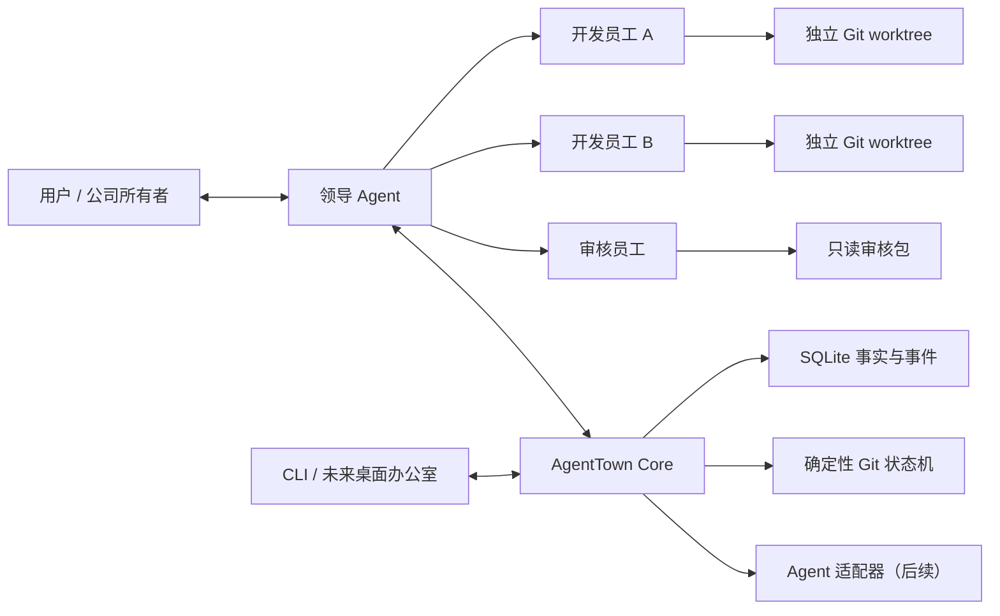

# AgentTown

> 把多个现成的 AI Agent 组织成一间运行在你电脑里的“赛博公司”。

[](https://www.gnu.org/licenses/agpl-3.0)
[](#当前状态)

AgentTown 是一个本地多 Agent 调度器。用户预先配置公司的岗位、员工和权限，由一名领导 Agent 理解目标、拆分任务并调度固定员工；开发、审核等员工在独立会话和 Git worktree 中协作。用户默认只和领导沟通，也可以随时接管某个员工会话。

AgentTown 不开发新的基础 Agent，而是计划把 Claude Code、OpenCode、Hermes Agent 等现有工具接入同一套确定性的公司运行机制。

## 为什么做 AgentTown

今天的 Agent 工具通常是一名用户操作一个会话：一个 Agent 同时理解需求、写代码、测试和审核，难以真正并行，也容易让上下文变得臃肿。

AgentTown 希望把它变成更直观的协作方式：

- 公司结构由用户决定，而不是由模型临时幻想员工；
- 每个员工有固定岗位、权限、模型和工作区；
- 领导负责调度，审核员独立验收，开发员工可以并行工作；
- 任务、事件、用量和上下文信息都来自可追踪事实；
- 未来用“办公室”看板展示每个员工正在做什么。



## 当前状态

**早期开发版，尚不能作为真实多 Agent 日用产品。**

当前已经完成：

- P1A：一间由四个 Fake Agent 组成的本地公司；
- Windows Named Pipe、SQLite 事实库、事件流、任务 DAG、暂停与恢复；
- CLI 的初始化、启动、状态、任务、时间线、暂停、恢复和停止；
- P1B Git 协作闭环：Git 协作契约、版本化存储、仓库安全预检、独立 worktree、结构化验证与审核、确定性候选集成、Git 冲突转结构化可审核任务、暂停保存与重启对账、workspaces/evidence/deliver/approvals/cleanup CLI，以及并行重启交付与冲突解决两条端到端场景。

当前尚未完成：

- Claude Code、OpenCode、Hermes Agent 的真实适配器（P1C 路线）；
- 面向普通用户的安装包；
- “赛博办公室”桌面 UI。

因此，目前能运行的是用于开发与验证架构的 **Fake Company**，不是产品设想中的真实 Agent 公司。P1B 的 Git 协作同样只能由确定性 Fake 场景驱动（`git-developer-a`、`git-developer-b`、`git-review-approve`、`git-review-reject`、`git-conflict`、`git-conflict-resolve`），P1C 会把这些场景替换为真实 Agent 适配器。精确进度见 [开发状态与经验](docs/development/status.md)。

## 本地体验

### 环境要求

- Windows
- Node.js 22 或更新版本
- pnpm 11.9.0
- Git 2.31 或更新版本

### 安装与检查

```powershell
git clone https://github.com/S1nc-777/AgentTown.git
Set-Location AgentTown
pnpm install
pnpm agenttown -- doctor
```

### 启动一次 Fake Company

建议在一个临时 Git 仓库里体验，避免把运行状态和 AgentTown 源码混在一起：

```powershell
$demo = Join-Path $env:TEMP "agenttown-demo"
New-Item -ItemType Directory -Path $demo
Set-Location $demo
git init
git config user.name "Demo"
git config user.email "demo@example.invalid"
git commit --allow-empty -m "initial"

$repo = "C:\path\to\AgentTown"
$tsx = Join-Path $repo "node_modules\tsx\dist\loader.mjs"
$cli = Join-Path $repo "packages\cli\src\main.ts"

node --import $tsx $cli init --template parallel-software
node --import $tsx $cli start
```

在另一个终端进入同一临时仓库：

```powershell
node --import $tsx $cli status
node --import $tsx $cli tasks
node --import $tsx $cli timeline
node --import $tsx $cli stop --yes
```

### Git 协作的前提与边界

P1B Git 协作（`workspaces`、`evidence`、`deliver`、`approvals`、`cleanup` 命令）要求：

- **Git 2.31 或更新版本**，且项目根目录必须是一个**已有至少一次提交的干净仓库**（`git status` 无改动）；
- Core 启动时会向仓库的本地 `info/exclude` 追加 `/.agenttown/`，所有运行状态、worktree 与审核证据都放在这个被本地忽略的目录里，不会进入提交；
- 每个任务在 `.agenttown/worktrees/<run-id>/` 下拥有独立 worktree 与分支，审核员只读取不可变的审核包（`.agenttown/runs/<run-id>/reviews/`）；
- 查看任务工作区：`node --import $tsx $cli workspaces`；
- 查看某一任务的不可变审核证据：`node --import $tsx $cli evidence <task-id> [--revision N]`；
- 查看已审核并通过集成校验的交付：`node --import $tsx $cli deliver`；
- 查看并批准待执行的验证命令建议：`node --import $tsx $cli approvals`、`approve <approval-id> --reason "..."`、`reject <approval-id> --reason "..."`；
- 清理一个运行的所有痕迹：`node --import $tsx $cli cleanup <run-id> --yes`（只能指定一个精确的 run id；`--branches` 与 `--evidence` 必须显式给出才会一并删除分支和审核证据）。

AgentTown **绝不自动 merge、push、创建 PR、发布或部署**。交付只推进独立的集成分支（`refs/heads/agenttown/<run-id>/integration`），用户主分支始终保持原状。`deliver` 会打印建议的只读检查命令，例如：

```powershell
git diff main..agenttown/<run-id>/integration
git log --oneline main..agenttown/<run-id>/integration
```

确认无误后由用户自己手动合并，例如：

```powershell
git merge agenttown/<run-id>/integration
```

AgentTown 不会替你执行这条合并命令。

更完整的开发说明见 [P1A Core 开发指南](docs/development/p1a-core.md)。

## 开发与验证

普通测试只使用 Fake Agent，不应调用真实 Agent 或消耗模型额度：

```powershell
$env:AGENTTOWN_FORBID_REAL_PROBES='1'
$env:AGENTTOWN_REAL_CODEX='0'
$env:AGENTTOWN_REAL_CLAUDE='0'

pnpm typecheck
pnpm test
pnpm test:p1b
pnpm probe:fake
```

`test:p1b` 运行 P1B 的两条确定性端到端场景（并行重启交付、冲突转解决任务），它们会在临时目录里创建真实的本地 Git 仓库与 worktree，但不会 push、部署或修改远程仓库。

## 安全边界

AgentTown 的目标不是让模型随意控制电脑。当前设计坚持：

- 领导只能调度用户预先配置的员工；
- 工作区必须位于经过验证的项目范围内；
- 写代码的员工使用独立分支和 worktree；
- 审核员默认只读取结构化审核包；
- 不自动 push，不猜测解决语义冲突；
- 删除、发布、安装和扩大权限等操作必须向用户申请；
- Agent 的文字输出不能绕过 Core 的权限和状态机。

## 路线图

- [x] P1A：Fake Company 核心闭环
- [x] P1B：Git 协作闭环（Fake-only 端到端验证完成）
- [ ] P1C：Claude Code、OpenCode、Hermes Agent 适配器
- [ ] P1D：四人真实 Agent Alpha 验收
- [ ] 桌面端“赛博办公室”看板

详细设计与实施计划：

- [P1 Headless MVP 设计](docs/superpowers/specs/2026-07-27-agenttown-headless-mvp-design.md)
- [P1B Git 协作闭环设计](docs/superpowers/specs/2026-07-29-agenttown-p1b-git-collaboration-design.md)
- [P1B 实施计划](docs/superpowers/plans/2026-07-29-agenttown-p1b-git-collaboration.md)

## 参与项目

AgentTown 仍处于架构成形阶段。欢迎提交 Issue 讨论产品理念、Agent 适配方式、公司模板、Git 安全边界和 Windows 体验，也欢迎在理解现有规格与测试边界后贡献代码。

## 许可证

项目采用 **AGPL-3.0-only**。仓库当前处于早期整理阶段，正式发布前还会补齐独立的许可证文本和贡献指南。
