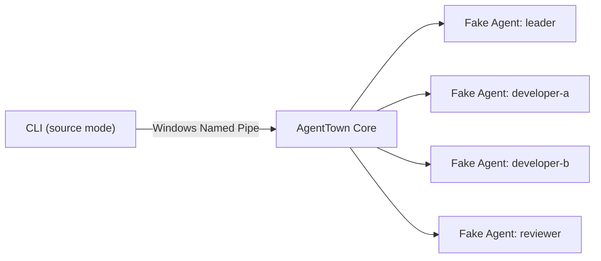

# AgentTown P1A Core development guide

P1A proves one local, fake-only AgentTown company across a Core process
restart. It is an engineering slice, not the finished desktop product.

## Prerequisites

- Windows
- Node.js 22 or newer
- pnpm 11.9.0
- Git

Install workspace dependencies from the repository root:

```powershell
pnpm install
```

## Safe verification

Keep all real adapter probes disabled while developing P1A:

```powershell
$env:AGENTTOWN_FORBID_REAL_PROBES='1'
$env:AGENTTOWN_REAL_CODEX='0'
$env:AGENTTOWN_REAL_CLAUDE='0'
pnpm typecheck
pnpm test
pnpm probe:fake
```

Run only the complete lifecycle acceptance test with:

```powershell
pnpm test:p1a
```

The process boundary under test is:



## Disposable Fake Company walkthrough

Use a disposable Git repository so runtime state cannot be confused with
source files:

```powershell
$demo = Join-Path $env:TEMP "agenttown-p1a-demo"
$repo = "C:\path\to\AgentTown"
$tsx = Join-Path $repo "node_modules\tsx\dist\loader.mjs"
$cli = Join-Path $repo "packages\cli\src\main.ts"
New-Item -ItemType Directory -Path $demo
Set-Location $demo
git init

node --import $tsx $cli init --template parallel-software
node --import $tsx $cli start
```

In another terminal, from the same disposable repository:

```powershell
$demo = Join-Path $env:TEMP "agenttown-p1a-demo"
$repo = "C:\path\to\AgentTown"
$tsx = Join-Path $repo "node_modules\tsx\dist\loader.mjs"
$cli = Join-Path $repo "packages\cli\src\main.ts"
Set-Location $demo

node --import $tsx $cli status
node --import $tsx $cli tasks
node --import $tsx $cli timeline
node --import $tsx $cli stop --yes
```

The workspace command is intended for repository development. When invoking
the source CLI directly, its current working directory is the selected
AgentTown project.

## Runtime-state ownership and cleanup

AgentTown owns only the selected project's `.agenttown/` directory:

- `company.yaml` is the local company definition;
- `agenttown.sqlite` stores company, task, session, checkpoint, usage and event
  facts;
- `logs/` is reserved for local runtime logs.

P1A validates that these paths remain inside the selected project and rejects
links or junctions at defined creation/open boundaries. Stop the company
before cleanup. In a disposable repository, verify the current directory and
then remove exactly `.agenttown/`; never recursively delete a computed,
unverified parent directory.

```powershell
Resolve-Path -LiteralPath .
Resolve-Path -LiteralPath .agenttown
Remove-Item -LiteralPath .agenttown -Recurse
```

## Recovery semantics

The CLI heartbeat owns a client lease. When the final client departs, Core
pauses dispatch, checkpoints all four configured sessions, stops the Fake
Agent children, persists `paused`, and closes its transport. On the next Core
start, `resume` loads that checkpoint. An adapter with a usable native session
ID records a `native` recovery decision; otherwise Core records `rebuilt`.
Tasks and the append-only event sequence survive either decision.

## P1A limitations

P1A intentionally has:

- no Git worktree integration despite workspace policy metadata;
- no real Codex, Claude Code, OpenCode or Hermes adapters;
- no desktop office UI;
- no push, deployment or telemetry behavior.

The pure-Node implementation cannot make a malicious concurrent local
filesystem replacement completely race-free on Windows. It performs repeated
real-path validation and exact non-recursive creation; eliminating the final
OS-open TOCTOU window would require a native handle-relative open API and is
outside P1A's local-filesystem trust model.
