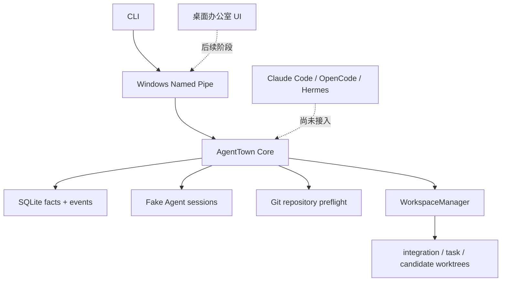

# AgentTown 开发状态与经验

- 更新日期：2026-07-30
- 当前开发分支：`codex/p1b-git-collaboration`
- P1B 基线：`2ea80ab`
- 当前功能提交：`b5dc9f1`
- 下一项任务：P1B Task 9

## 一句话状态

AgentTown 已经能运行一间可暂停、恢复和观察的 Fake Agent 公司，并完成了 Git 协作底座的前八项；它还没有接入真实 Agent，暂时不能称为可日用的多 Agent 产品。

## 已完成

### P1A：Fake Company 核心闭环

P1A 已完成并位于 `main`：

- 固定四员工公司模板；
- SQLite 事实库和 append-only 事件；
- Windows Named Pipe IPC；
- 任务 DAG、派发、审核、暂停、检查点和恢复；
- CLI 状态、任务和时间线；
- 确定性 Fake Agent 与端到端验收。

P1A 是架构验证切片，不包含真实 Agent、Git worktree 协作或桌面 UI。

### P1B：Git 协作闭环

P1B 计划共有 12 项。目前 Task 1–8 已完成并通过独立规格/代码质量审查，Task 9–12 尚未开始。

| 任务 | 状态 | 提交范围 | 结果 |
| --- | --- | --- | --- |
| 1. Git 契约与公司配置 | 完成 | `2ea80ab..4c61014` | 审查通过 |
| 2. Schema v2 与 Git 事实存储 | 完成 | `4c61014..f01c976` | 审查通过 |
| 3. Git 边界与仓库预检 | 完成 | `f01c976..ef29598` | 审查通过 |
| 4. Run/Task worktree 生命周期 | 完成 | `ef29598..bf01269` | 审查通过 |
| 5. 结构化验证与证据日志 | 完成 | `1b27f2e..baad570` | 审查通过 |
| 6. 提交验证与不可变审核包 | 完成 | `31ce670..589c5ea` | 审查通过 |
| 7. 审核状态与 Git 工作流协调器 | 完成 | `39a34d5..632a13e` | 审查通过 |
| 8. 确定性候选集成与原子 ref 推进 | 完成 | `c2a4848..b5dc9f1` | 审查通过 |
| 9–12. 冲突、恢复、CLI、E2E | 待办 | — | 尚未开始 |

Task 8 最终验证证据：

- Task 8 定向与存储测试：57/57 通过；
- 相关扩展测试：177/177 通过；
- Core：18 个测试文件、346 个测试通过；
- 工作区类型检查：全部适用项目通过；
- 独立复审：Spec Approved、Code-quality Approved；
- 没有启动 Task 9。

## 当前架构边界

已经实现的 P1B Git 底座负责：

- 读取并验证 Git 仓库基线；
- 拒绝 dirty、detached、进行中的 Git 操作和能力不足的仓库；
- 用确定性、可审计的状态机创建 integration、task 和 candidate worktree；
- 在 Git 操作前持久化意图，操作后验证路径、ref 和 commit；
- 暂停时保留工作区，清理时只处理能够证明归属且状态一致的资产；
- 对外部移动、缺失、ref 改写或路径占用记录 `tampered`/`missing`，不猜测修复。
- 只执行公司配置或用户精确批准的无 shell 验证命令；
- 对命令 scope、公司归属、workspace、cwd 和授权指纹进行执行前校验；
- 生成有界、脱敏、哈希校验且原子发布的验证证据；
- 以身份安全、绝对截止时间和 fail-closed 语义处理进程树清理。
- 从 Git 自行推导连续提交、文件、二进制元数据和文本 patch；
- 生成逐文件哈希、不可覆盖、可重新验证的独立审核包。

## 开发经验

### 1. 配置默认值和运行硬上限必须分开

“默认 30 秒”不等于“最多只能配置 30 秒”。运行时契约要分别描述默认值、最小值和最大值，并让解析器、类型和测试使用同一来源。

### 2. Windows 路径语义不能按 POSIX 直觉处理

驱动器相对路径（例如 `C:foo`）、junction、reparse point、大小写和 `realpath` 都会影响边界判断。安全检查必须同时验证词法路径、最近存在父目录、真实路径和 Git 自己报告的 worktree 映射。

### 3. SQLite 迁移不仅要看列名

只检查 `PRAGMA table_info` 无法发现索引方向、唯一性、局部条件或表 SQL 的语义漂移。Schema v2 使用规范化 SQL 和 `index_xinfo` 验证真实结构，避免“版本号正确但数据库含义错误”。

### 4. 事务提交和事件发布是两个阶段

事实与事件已经在数据库事务中持久化后，同步监听器抛错不能让生命周期 API 报告失败，也不能回滚已经正确创建的 Git 资产。正确做法是进行精确 durable readback，把发布错误与事实提交结果分开。

### 5. 不可逆操作前先持久化意图

清理 worktree 采用：

1. 持久化 `removing` 意图；
2. 再执行经过所有权验证的 Git 操作；
3. 验证结果；
4. 提交 `missing`/removed 事实与事件。

这样数据库写入失败或进程中断后，下一次运行仍能识别并恢复未完成的清理。

### 6. “曾经属于我”不等于“现在仍属于我”

路径初次检查为空，不能证明几毫秒后出现在该路径的目录也归 AgentTown。清理前后都要复核路径；遇到重新占用、同一 branch 出现在其他 worktree、或 Git metadata 不唯一时，必须停止并记录 `tampered`，不能使用递归强制删除。

### 7. 名称映射必须是注入式的

简单地把多个 ID 用连字符拼接会产生碰撞。路径使用分层目录；公开 task ref 保持既定契约，并保留会和 candidate/integration 命名空间冲突的 employee 根。

### 8. 所有权检查必须在任何 Git 操作之前

`WorkspaceManager` 的 `companyId` 不是装饰字段。每次通过全局 ID 读取 run 或 workspace 后，都要确认它属于当前公司，再允许创建、暂停或清理。

### 9. Windows 上真实 Git 测试要避免无意并发

多个 Git-heavy Vitest 运行重叠时，会显著放大进程启动延迟。测试只对三条已证明需要的真实 Git 用例使用局部 20 秒上限，没有扩大生产默认值、全局超时、重试或 sleep。

### 10. 未脱敏数据不能先写临时文件

“最终文件会脱敏”不足以保护进程崩溃、断电或 rename 失败。Task 5 在有界内存中按 stdout/stderr 保留跨 chunk 状态，先完成脱敏，再把安全内容写入临时证据；跨 chunk token、Bearer 和常见敏感赋值也不能靠插入日志标签绕过。

### 11. 进程清理需要验证身份，而不只是 PID

PID 会重用。Windows 使用 PID 与 CreationDate，Linux 使用 `/proc/<pid>/stat` 的 starttime ticks；终止前后都要复核已经捕获的树成员。身份查询失败、PID 重用或成员仍存活都必须得到 `cleanup_failed`，并与 workflow 暂停在同一事务落库。

### 12. 授权必须绑定公司、工作区和精确命令

一个 `CompanyDefinition` 不能替另一个公司的 run 授权。配置 revision、companyId、workspaceId、executable、args、cwd 和 timeout 都是权限边界；建议命令中的明显 token/password/API-key/Bearer 字面量在持久化 grant 前直接拒绝。

### 13. TypeScript 类型不是运行时信任边界

名称为 `ValidatedSubmission` 的结构对象仍可被调用者伪造。审核包发布前必须重新从 Git 和 CoreStore 派生提交、patch、文件、任务负责人、状态和验证证据，并逐字段比较；不能因为编译期类型正确就跳过权威校验。

### 14. 不可变证据需要文件系统与数据库同时成立

审核包先写入唯一临时目录，逐文件 fsync 和校验，最后发布并把 record/event 在一个事务中提交。目标目录和数据库记录只有完全一致时才允许幂等返回；不能覆盖、不能用调用者自构造 record 验证，也不能在 DB 失败后把身份不明的目录当作自己拥有。

### 15. Git 的展示扩展也属于输入面

`--no-ext-diff` 不会关闭 textconv。权威 patch 还必须使用 `--no-textconv`，否则仓库或用户配置可能把二进制文件转换成文本并混入审核证据。

### 16. 兼容流程的选择必须失败关闭

只要活跃 Git run 中的任务归属于 `git_worktree` 员工，就必须由 Git 工作流协调器处理。工作区记录缺失或异常时应直接报错，不能回落到 Fake 工作流，否则结构化提交、独立审核和集成门禁都会被绕过。

### 17. 先验证 Git 事实，再执行项目命令

即使验证命令来自公司固定配置，也不能在确认工作区、提交范围、HEAD 和干净状态前执行。权威 Git 校验失败时，项目命令调用次数必须为零；完整证据校验则在命令执行后再次绑定实际结果。

### 18. 原子事务入口也必须验证完整身份

事务内部读取到正确的 run 和 task 还不够，调用者提交的新记录也必须精确匹配 `runId`、`taskId`、revision 和决定对应状态。否则一次“原子提交”仍可能把属于其他审查的对象一起写入。

### 19. Git 与 SQLite 之间需要可对账意图，而不是自动重试

候选验证通过后，Git ref 的 compare-and-swap 与 SQLite 提交无法组成真正的跨系统事务。正确做法是在任何候选变更前写入 `prepared`，并在 CAS 或事实提交中断后停止。后续调用看到同一 revision 已有 attempt 时只能幂等返回既有终态或要求对账，不能创建第二个 attempt 猜测重试。

### 20. “同类工作区”不等于“这个 attempt 的工作区”

集成验证不能只绑定到同一 run 下任意 `candidate`。执行入口和最终事实事务都必须重新核对唯一 workspace 的 ID、candidate ref、base/head commit 和 attempt 身份，否则其他候选的测试结果可能被嫁接到当前集成。

### 21. 幂等成功必须重新认证完整历史

返回“已经集成”前，不只要看到 completed task 和 committed attempt，还要验证 exact run/ref/workspace/submission，以及唯一、由 Core 写入、payload 完整绑定的 `git.integration.committed` 与 `task.completed` 事件。幂等不是放宽校验，而是对既有事实做更严格的重放认证。

## 已知问题与环境残留

- 真实 Claude Code、OpenCode、Hermes Agent 适配尚未开始。
- 根目录 `pnpm typecheck` 的依赖构建顺序仍值得后续整理；各包脚本目前承担部分预构建责任。
- 截至本次复核，Windows 临时目录中有 25 个历史 `agenttown-git-*` 和 27 个 `agenttown-core-*` fixture，其中包含早期取消、故意 RED 和被外层命令上限终止的测试残留。没有存活的 Vitest、验证命令或相关 Git 进程占用它们。经过解析和逐项验证的 PowerShell 删除命令被环境策略在执行前拒绝；没有换用其他 shell 绕过策略，也没有声称这些目录已删除。
- 仓库包元数据声明 `AGPL-3.0-only`，独立 `LICENSE` 文件和贡献指南仍待补齐。

## 下一步：Task 9

下一次开发从 [P1B 实施计划的 Task 9](../superpowers/plans/2026-07-29-agenttown-p1b-git-collaboration.md#task-9-conflict-tasks-and-superseding-submissions) 继续：

> Conflict Tasks and Superseding Submissions

目标是在候选 cherry-pick 冲突时保持正式 integration 干净，创建不形成依赖环的未分配冲突任务，并让经过完整审核的解决提交安全取代原 submission。

恢复开发前应确认：

1. 分支为 `codex/p1b-git-collaboration`；
2. `git status --short` 为空；
3. HEAD 至少包含 `b5dc9f1`；
4. Task 1–8 不重新实现；
5. 先读 P1B 设计、实施计划和本文；
6. 使用 TDD 和独立只读复审；
7. 不在同一 Windows 工作区并发运行多套真实 Git 测试。

## 精简续接摘要

如果后续对话上下文被压缩，只需保留以下事实：

- 产品：AgentTown，本地“赛博公司”式多 Agent 调度器；
- 当前真实能力：P1A Fake Company + P1B Git 底座 Task 1–8；
- 当前分支：`codex/p1b-git-collaboration`；
- 当前功能提交：`b5dc9f1`；
- Task 8 已经完整测试并通过独立复审；
- Task 9–12 尚未开始；
- 下一步只做 Task 9，不重做之前任务；
- README 与本文是面向用户和开发者的当前权威摘要，详细规则以 P1B spec/plan 为准。
