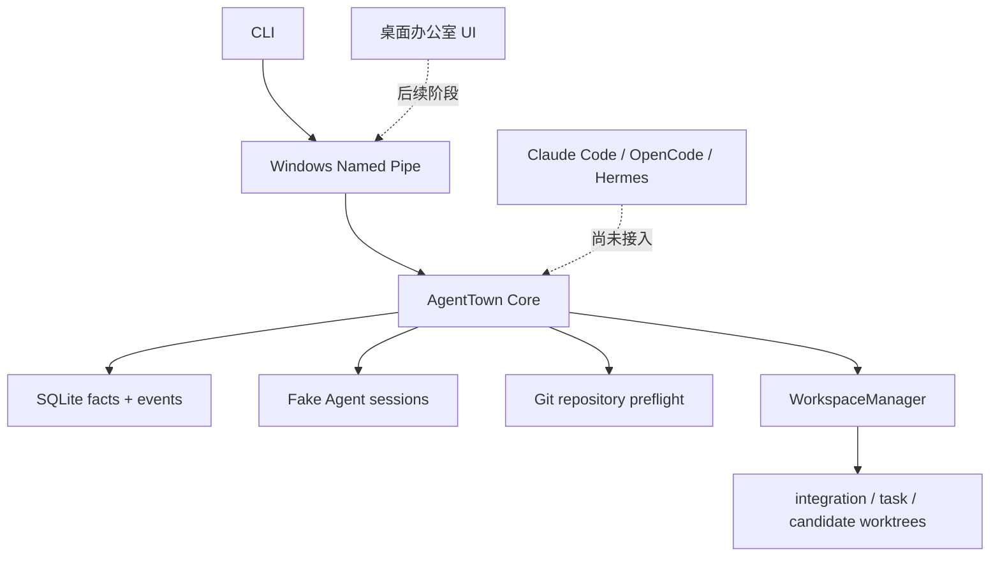

# AgentTown 开发状态与经验

- 更新日期：2026-07-30
- 当前开发分支：`codex/p1b-git-collaboration`
- P1B 基线：`2ea80ab`
- 当前实现提交：`bf01269`
- 下一项任务：P1B Task 5

## 一句话状态

AgentTown 已经能运行一间可暂停、恢复和观察的 Fake Agent 公司，并完成了 Git 协作底座的前四项；它还没有接入真实 Agent，暂时不能称为可日用的多 Agent 产品。

## 已完成

### P1A：Fake Company 核心闭环

P1A 已完成并位于 `main`：

- 固定四员工公司模板；
- SQLite 事实库和 append-only 事件；
- Windows Named Pipe IPC；
- 任务 DAG、派发、审核、暂停、检查点和恢复；
- CLI 状态、任务和时间线；
- 确定性 Fake Agent 与端到端验收。

P1A 是架构验证切片，不包含真实 Agent、Git worktree 协作或桌面 UI。

### P1B：Git 协作闭环

P1B 计划共有 12 项。目前 Task 1–4 已完成并通过独立规格/代码质量审查，Task 5–12 按用户要求暂停。

| 任务 | 状态 | 提交范围 | 结果 |
| --- | --- | --- | --- |
| 1. Git 契约与公司配置 | 完成 | `2ea80ab..4c61014` | 审查通过 |
| 2. Schema v2 与 Git 事实存储 | 完成 | `4c61014..f01c976` | 审查通过 |
| 3. Git 边界与仓库预检 | 完成 | `f01c976..ef29598` | 审查通过 |
| 4. Run/Task worktree 生命周期 | 完成 | `ef29598..bf01269` | 审查通过 |
| 5–12. 验证、审核、集成、恢复、CLI、E2E | 暂停 | — | 尚未开始 |

Task 4 最终验证证据：

- `WorkspaceManager` 定向测试：24/24 通过；
- Core：12 个测试文件、223 个测试通过；
- 工作区类型检查：全部适用项目通过；
- 独立复审：Spec Approved、Code-quality Approved；
- 没有启动 Task 5。

## 当前架构边界

已经实现的 P1B Git 底座负责：

- 读取并验证 Git 仓库基线；
- 拒绝 dirty、detached、进行中的 Git 操作和能力不足的仓库；
- 用确定性、可审计的状态机创建 integration、task 和 candidate worktree；
- 在 Git 操作前持久化意图，操作后验证路径、ref 和 commit；
- 暂停时保留工作区，清理时只处理能够证明归属且状态一致的资产；
- 对外部移动、缺失、ref 改写或路径占用记录 `tampered`/`missing`，不猜测修复。

## 开发经验

### 1. 配置默认值和运行硬上限必须分开

“默认 30 秒”不等于“最多只能配置 30 秒”。运行时契约要分别描述默认值、最小值和最大值，并让解析器、类型和测试使用同一来源。

### 2. Windows 路径语义不能按 POSIX 直觉处理

驱动器相对路径（例如 `C:foo`）、junction、reparse point、大小写和 `realpath` 都会影响边界判断。安全检查必须同时验证词法路径、最近存在父目录、真实路径和 Git 自己报告的 worktree 映射。

### 3. SQLite 迁移不仅要看列名

只检查 `PRAGMA table_info` 无法发现索引方向、唯一性、局部条件或表 SQL 的语义漂移。Schema v2 使用规范化 SQL 和 `index_xinfo` 验证真实结构，避免“版本号正确但数据库含义错误”。

### 4. 事务提交和事件发布是两个阶段

事实与事件已经在数据库事务中持久化后，同步监听器抛错不能让生命周期 API 报告失败，也不能回滚已经正确创建的 Git 资产。正确做法是进行精确 durable readback，把发布错误与事实提交结果分开。

### 5. 不可逆操作前先持久化意图

清理 worktree 采用：

1. 持久化 `removing` 意图；
2. 再执行经过所有权验证的 Git 操作；
3. 验证结果；
4. 提交 `missing`/removed 事实与事件。

这样数据库写入失败或进程中断后，下一次运行仍能识别并恢复未完成的清理。

### 6. “曾经属于我”不等于“现在仍属于我”

路径初次检查为空，不能证明几毫秒后出现在该路径的目录也归 AgentTown。清理前后都要复核路径；遇到重新占用、同一 branch 出现在其他 worktree、或 Git metadata 不唯一时，必须停止并记录 `tampered`，不能使用递归强制删除。

### 7. 名称映射必须是注入式的

简单地把多个 ID 用连字符拼接会产生碰撞。路径使用分层目录；公开 task ref 保持既定契约，并保留会和 candidate/integration 命名空间冲突的 employee 根。

### 8. 所有权检查必须在任何 Git 操作之前

`WorkspaceManager` 的 `companyId` 不是装饰字段。每次通过全局 ID 读取 run 或 workspace 后，都要确认它属于当前公司，再允许创建、暂停或清理。

### 9. Windows 上真实 Git 测试要避免无意并发

多个 Git-heavy Vitest 运行重叠时，会显著放大进程启动延迟。测试只对三条已证明需要的真实 Git 用例使用局部 20 秒上限，没有扩大生产默认值、全局超时、重试或 sleep。

## 已知问题与环境残留

- 真实 Claude Code、OpenCode、Hermes Agent 适配尚未开始。
- 根目录 `pnpm typecheck` 的依赖构建顺序仍值得后续整理；各包脚本目前承担部分预构建责任。
- 此轮开发早期取消的真实 Git 测试在 Windows 临时目录留下 18 个 `agenttown-git-*` fixture。复核时没有存活的 Vitest/Git 进程占用它们。原计划使用经过解析和逐项验证的 PowerShell 删除，但环境策略在执行前拒绝了命令；没有换用其他 shell 绕过策略，也没有声称这些目录已删除。
- 仓库包元数据声明 `AGPL-3.0-only`，独立 `LICENSE` 文件和贡献指南仍待补齐。

## 下一步：Task 5

下一次开发从 [P1B 实施计划的 Task 5](../superpowers/plans/2026-07-29-agenttown-p1b-git-collaboration.md#task-5-structured-validation-runner-and-evidence-logs) 继续：

> Structured Validation Runner and Evidence Logs

目标是让 Core 在已注册 worktree 中无 shell 地执行允许的验证命令，记录有界、脱敏、可审计的输出，并对未经配置的命令生成需要用户明确批准的精确授权。

恢复开发前应确认：

1. 分支为 `codex/p1b-git-collaboration`；
2. `git status --short` 为空；
3. HEAD 至少包含 `bf01269`；
4. Task 1–4 不重新实现；
5. 先读 P1B 设计、实施计划和本文；
6. 使用 TDD 和独立只读复审；
7. 不在同一 Windows 工作区并发运行多套真实 Git 测试。

## 精简续接摘要

如果后续对话上下文被压缩，只需保留以下事实：

- 产品：AgentTown，本地“赛博公司”式多 Agent 调度器；
- 当前真实能力：P1A Fake Company + P1B Git 底座 Task 1–4；
- 当前分支：`codex/p1b-git-collaboration`；
- 当前实现提交：`bf01269`；
- Task 4 已经完整测试并通过独立复审；
- Task 5–12 尚未开始；
- 下一步只做 Task 5，不重做之前任务；
- README 与本文是面向用户和开发者的当前权威摘要，详细规则以 P1B spec/plan 为准。
