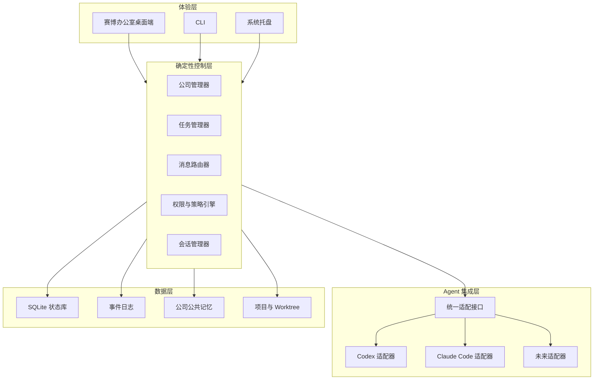
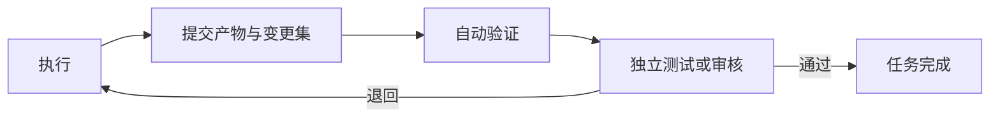

# AgentTown 产品与系统设计

日期：2026-07-20
状态：已确认设计
许可证：AGPL-3.0
项目名称：AgentTown
GitHub Description：An open-source cyber office for orchestrating multiple AI agents—assign roles, coordinate tasks, review work, and watch them build projects together.

## 1. 产品概要

AgentTown 是一个运行在个人电脑上的开源多 Agent 协作工具。它不开发新的 Agent，而是把 Codex、Claude Code 等已有 Agent 会话组织成一间可视化的“赛博公司”：用户是公司所有者，一名领导 Agent 负责理解目标、拆分任务和管理团队，固定员工 Agent 负责执行、测试与审核，确定性调度内核负责会话、权限、任务事实、通信、预算和恢复。

首版面向懂少量技术、能够通过 AI 编程工具完成小项目的重度用户。第一阶段聚焦软件项目，但底层组织、任务和适配接口不得绑定编程领域，以便后续扩展产品、研究、写作等模板。

产品的传播定位是“在电脑里放一间赛博公司”。办公室隐喻服务于理解和传播，不是底层运行模型。外观可以有趣，内核必须保持专业和可控。

## 2. 目标与非目标

### 2.1 核心目标

1. 让多个异构 Agent 在同一项目中并行分工。
2. 让用户主要与领导 Agent 沟通，同时保留直接接管员工的兜底能力。
3. 用确定性状态约束 Agent 幻觉，确保员工、任务、权限和预算是可验证事实。
4. 通过办公室、任务看板和时间线展示每名 Agent 正在做什么。
5. 支持后台持续运行、会话恢复、审核返工和人工审批。
6. 用模板把初次配置时间控制在十几分钟内。

### 2.2 首版非目标

- 不自研模型或 Agent 推理循环。
- 不开发通用企业工作流引擎。
- 不支持领导自动招聘或动态扩编。
- 不做多层级管理、多个部门或多家公司协作。
- 不做账号、云同步、多人协作和远程调度。
- 不做在线模板市场、Token 售卖或统一模型网关。
- 不做复杂办公室装修、人物养成或高成本动画。
- 不宣称支持所有 Agent；首版仅正式支持两种。

## 3. 已确定的产品原则

- 用户是公司所有者，负责项目目标、关键方向和最终干预。
- 调度器创建领导和全部员工会话。
- 员工名单、职位和数量由用户或模板预先确定；领导不能自行新增员工。
- 公司启动时全体员工会话一起启动，空闲员工保持待命。
- 默认只与领导沟通；用户可随时接管任意员工会话。
- 领导负责智能判断；调度器负责验证和执行系统操作。
- 员工可以提出申请，涉及扩权、替换、重大歧义或危险操作时由领导向用户请求决定。
- 员工之间可以通信，但消息经过路由器并对领导可见。
- 实用优先于真实公司模拟，只保留对 Agent 协作有效的组织机制。
- 首发 Windows，提供桌面端、CLI 和系统托盘。
- 数据默认全部保存在本地。

## 4. 总体架构：混合控制平面

采用“领导 Agent 决策 + 确定性内核执行”的混合架构。



权力边界如下：

| 决策 | 负责人 |
|---|---|
| 理解目标、拆分任务、选择执行者 | 领导 Agent |
| 员工是否存在、请求是否允许 | 调度器 |
| 启动、恢复、暂停、停止会话 | 调度器 |
| 任务、依赖、审核和预算的真实状态 | 调度器 |
| 具体工作方式和工具使用 | 执行员工 Agent |
| 项目方向、扩权和最终交付 | 用户 |

Agent 发出的管理动作都是提案。只有通过策略引擎验证后，才成为真实状态。

## 5. 核心模块

### 5.1 公司管理器

读取模板并创建公司实例，维护公司所有者、领导、固定员工、职位、Agent 类型、权限与上下级关系。员工使用稳定的内部 ID，进程重启不得改变员工身份。

### 5.2 会话管理器

负责后台虚拟终端和 Agent 进程：检测、启动、输入、输出流、中断、停止、原生会话恢复、语义重建、人工接管以及进程异常检测。桌面 UI 关闭不影响后台会话。

### 5.3 Agent 适配层

每个适配器实现以下最小接口：

```text
detect()
start()
send()
stream_output()
interrupt()
resume()
stop()
capabilities()
usage()
```

适配器必须声明是否支持原生恢复、Token 数据、结构化输出、中断和非交互模式。上层不得假定所有 Agent 能力相同。首版以后台 PTY/虚拟终端接入为主；稳定 SDK 可在后续提供原生适配。

首版目标适配器明确为 Codex CLI 和 Claude Code CLI。实施前的可行性验证必须确认两者在 Windows 上的启动、输入、输出监听、中断和恢复路径。若任一工具存在阻断性交互限制，则以 OpenCode 作为首个替代候选，并在实施计划的可行性门槛中记录替换决定。

### 5.4 任务管理器

任务必须具有 ID、目标、负责人、输入、产物、验收标准、依赖、状态和返工次数。正式任务不能只存在于领导对话中。

任务状态为：待处理、工作中、等待、阻塞、待审核、已完成、失败。用户接管属于员工会话状态，不改变任务本身的语义。

### 5.5 消息路由器

所有跨 Agent 通信经过路由器。路由器验证身份和权限、记录消息、转换目标格式、限制通信轮次和预算，并把员工间沟通同步给领导。员工需要协作时先向领导申请；审核者可直接要求执行者返工，同时同步领导。

### 5.6 权限与策略引擎

验证固定员工名单、任务权限、文件权限、预算、返工次数、审批要求、接管锁和通信循环。首版公司级权限只区分只读与可写；底层系统权限继承第三方 Agent 的现有配置。

### 5.7 事件存储

公司启动、会话启动、任务创建、分配、消息、审核、接管、审批、崩溃、恢复和完成均写入事件。办公室、看板、时间线、通知和恢复逻辑读取同一事件来源。

SQLite 保存结构化状态和消息索引；原始终端输出存日志文件；公共记忆使用 Markdown/YAML；代码成果由 Git 管理。

## 6. 通信协议

协议分成结构化管理消息和自然语言工作消息。

### 6.1 结构化管理消息

核心命令包括：

```text
task.create
task.assign
task.cancel
task.request_review
task.approve
task.reject
employee.message
employee.status
user.approval.request
project.complete.request
```

不向领导提供 `employee.create`。领导若认为团队不足，只能向用户提交带理由的申请。

每个管理请求至少包含消息类型、发送者、目标、任务 ID、理由和关联事件 ID。调度器返回明确的接受或拒绝结果，不允许静默失败。

### 6.2 自然语言工作消息

任务内容使用自然语言，并附带职位、公共记忆、当前任务、验收标准、工作目录、权限和汇报格式。员工应使用约定的状态标记和产物清单汇报，但系统不得把格式遵守当作绝对前提。

状态判定顺序为：结构化标记、适配器解析、状态不确定、领导查询、用户介入。

### 6.3 人工接管

接管期间暂停向该员工自动投递消息。用户归还控制后，员工生成干预摘要，调度器记录修改和决策并同步领导，然后恢复自动调度。

## 7. 上下文与公共记忆

采用三层模型：

1. **事实层**：SQLite 保存员工、任务、会话、预算、审批和事件，Agent 不能直接修改。
2. **公司层**：`.dispatcher/` 内保存项目目标、规范、决策、术语和交接文档。
3. **任务层**：只向员工注入完成当前任务所需的最小上下文。

目录结构：

```text
.dispatcher/
├── company.yaml
├── project-brief.md
├── conventions.md
├── decisions.md
├── glossary.md
└── handoffs/
```

员工可提出公共记忆修改建议；领导批准后由调度器写入。公共记忆只保存稳定结论，不保存全部闲聊。

上下文接近上限时，由独立摘要流程生成摘要，再由原员工确认。无法恢复原生会话时，调度器使用职位、任务、公共记忆、已完成事项、未解决问题和最近决策构成交接包，重建的新会话必须明确标记为“重建”。

## 8. 文件隔离与集成

软件项目使用一个主工作区和每名可写员工的独立 Git Worktree。领导、测试者和审核者默认只读。员工提交明确的变更集，再由集成流程合并到主工作区。

用户直接修改主工作区后，调度器通知受影响员工重新同步。非 Git 项目提示初始化 Git；用户拒绝时进入明确标记的共享目录降级模式。非代码模板使用独立产物目录和产物清单，不强制 Git Worktree。

## 9. 审核与返工

执行者不能自行完成审核。标准闭环为：



- 审核者使用不同会话，模板可配置不同 Agent 产品。
- 审核依据是原始任务、验收标准、变更、测试和完成摘要。
- 审核者不得静默改变需求；需求问题必须上报领导。
- 连续退回两次后暂停任务，由领导向用户说明情况并请求方案。
- 项目交付前进行一次跨任务整体审核。

## 10. 审批、预算与异常恢复

危险命令、登录授权、超预算、连续返工、反复崩溃、重大歧义、替换员工和最终交付进入统一审批队列。用户离开时，无依赖任务可以继续；必须审批的相关任务进入等待。

主要异常策略：

| 异常 | 行为 |
|---|---|
| UI 崩溃 | 后台内核和 Agent 继续运行 |
| 单个员工崩溃 | 先恢复原生会话，再语义重建 |
| 同一员工连续崩溃两次 | 暂停任务并请求用户决定 |
| 领导崩溃 | 员工完成当前任务，但不接收新任务 |
| 长时间无输出 | 标记可能停滞，不立即杀死 |
| 消息循环 | 达到轮次或 Token 上限后中断 |
| 预算耗尽 | 暂停新调用并请求用户 |
| 合并冲突 | 交给集成角色；失败后询问用户 |
| 电脑休眠或关机 | 唤醒后按保存状态恢复 |
| 调度器异常退出 | 下次启动展示恢复清单，由用户确认 |

恢复顺序为：重新连接存活进程、恢复原生会话、创建新会话并注入交接包。

## 11. 桌面体验

桌面端包含项目列表、赛博办公室、任务看板、事件时间线和公司设置。

办公室是默认首页，使用简单 2D 或像素风。顶部显示项目状态、预算、暂停全公司和待审批。中间显示固定工位，右侧固定领导对话区。员工状态通过轻量动画、气泡和图标表达空闲、工作、等待、阻塞、待审核、被接管、异常和会话重建。

点击员工打开侧栏，展示职位、Agent 类型、当前任务、状态、上下文连续性、Token、工作区、最近汇报、对话、只读终端和接管按钮。Token 数据无法取得时明确显示“不可用”，不做虚假估算。

任务看板仅包含待处理、工作中、等待/阻塞、待审核和已完成。时间线展示可理解的正式事件，不等同于聊天记录。

## 12. CLI 与后台进程

CLI 和桌面端通过本地 IPC 连接同一后台调度内核。关闭桌面端不停止公司。首版命令范围：

```text
dispatcher start <project>
dispatcher status
dispatcher employees
dispatcher tasks
dispatcher logs <employee>
dispatcher takeover <employee>
dispatcher pause
dispatcher resume
dispatcher stop
```

系统托盘显示后台运行状态和待审批数量，并提供打开界面、暂停和停止入口。

## 13. 公司模板

模板包含公司通信规则、最大消息轮次、最大返工次数、固定员工、领导、职位、Agent 类型、只读/可写权限和审核流程。每个职位具有职责、允许事项、禁止事项、输入要求、产出格式、汇报格式和审核标准。

首版内置标准软件开发小队和极简小队两个模板，支持 GUI 编辑及 YAML 导入导出，不提供在线市场。模板不得执行安装代码或扩大权限。

默认标准小队为四个会话：领导、开发者、测试者和审核者。同一种 Agent 产品可创建多个员工会话。

## 14. 启动与完整运行流程


任何必要 Agent 未安装或未登录时，公司不带病启动，而是显示明确修复指引。

## 15. 进程架构与技术选择门槛

桌面 UI、CLI 和后台内核必须进程分离，并通过版本化本地 IPC 协议通信。虚拟终端、状态库和 Agent 进程仅由后台内核持有。

桌面框架在实施阶段通过一个限时可行性验证决定，而不是在产品设计中按偏好选择。候选至少包括 Electron/TypeScript 与 Tauri/Web UI + 独立核心。验证必须比较：Windows PTY 集成稳定性、后台进程管理、内嵌终端、打包复杂度、安装体积、开发效率和崩溃隔离。选出能最快稳定跑通两种真实 Agent 的方案；UI 体积不能以牺牲核心可靠性为代价。

## 16. 测试策略

### 16.1 确定性模拟 Agent

提供脚本化测试 Agent，覆盖正常完成、格式错误、无输出、请求审批、审核退回、崩溃恢复、消息循环和预算耗尽。普通 CI 以模拟 Agent 为主。

### 16.2 单元测试

覆盖任务状态机、权限、固定员工限制、消息路由、返工次数、预算、接管锁、恢复决策和模板校验。

### 16.3 适配器契约测试

验证检测、启动、输入、输出、中断、退出识别、能力声明和支持时的恢复。

### 16.4 集成测试

验证多员工并行、任务依赖、后台持续运行、崩溃恢复、Worktree 隔离、审核返工、人工接管和一键暂停。

### 16.5 真实 Agent 冒烟测试

发布前使用真实 Codex 和 Claude Code 完成固定小项目，验证“需求确认—拆分—编码—测试—审核—返工—交付”完整闭环。真实模型测试不进入普通 CI。

## 17. 首版验收标准

首版只有同时满足以下条件才可发布：

1. 能检测并使用两种受支持 Agent。
2. 能通过官方模板启动领导、开发者、测试者和审核者四个后台会话。
3. 用户只与领导沟通即可推动项目。
4. 领导能创建、分配和并行安排任务。
5. 开发者在隔离工作区完成真实修改。
6. 测试和审核会话能检查成果并触发返工。
7. 办公室、看板和时间线显示同一份真实状态。
8. 用户能接管并归还任意员工。
9. UI 关闭后后台继续运行。
10. 中断后能恢复或明确重建会话。
11. 权限、预算、消息轮次和固定员工约束有效。
12. 最终交付一个可以运行的小型软件项目。

## 18. 开源与品牌

代码以 AGPL-3.0 发布，要求公开分发和适用网络服务场景下的受约束修改继续提供对应源码。项目名称与 Logo 使用单独的商标政策，防止第三方冒充官方版本。正式发布前应补充完整 LICENSE、版权声明、贡献者协议选择和商标使用说明。

## 19. 实施分解边界

本设计描述完整首版产品，但实施必须拆分为连续子项目：

1. Windows PTY 与两种 Agent 的可行性验证。
2. 无 UI 的调度内核、模拟 Agent 和状态机。
3. 两个真实 Agent 适配器。
4. 任务、通信、审批、记忆与 Worktree 闭环。
5. 桌面办公室、看板、时间线和内嵌终端。
6. CLI、系统托盘、恢复和打包。
7. 真实小项目端到端验收与开源发布准备。

每个子项目都必须保持独立接口和可测试边界，避免一次实现整个系统。
