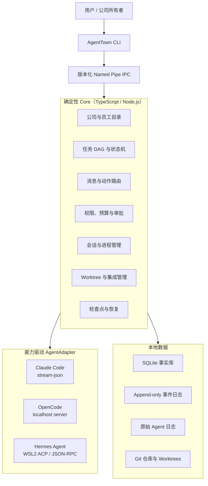
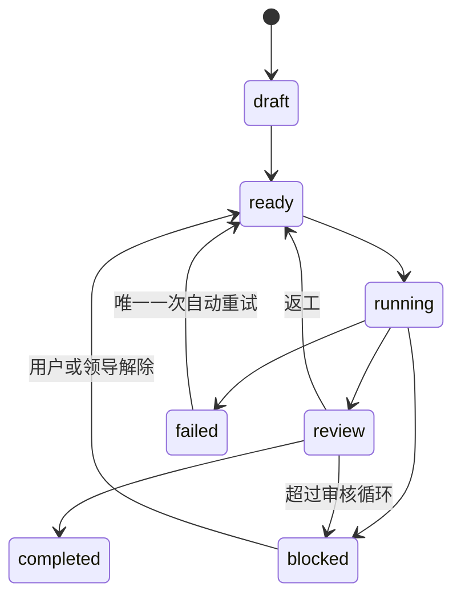

# AgentTown P1 Headless MVP 设计规格

- 日期：2026-07-27
- 状态：已完成产品讨论，待仓库评审
- 许可证：AGPL-3.0
- 首发平台：Windows，Hermes Agent 通过 WSL2 运行
- 首版界面：CLI；桌面“赛博办公室”推迟到 Core 可日用之后

## 1. 决策摘要

AgentTown 是一个运行在用户电脑上的开源多 Agent 调度器。它不开发新的 Agent，而是把 Claude Code、OpenCode、Hermes Agent 等已有产品组织成一间“赛博公司”：用户是公司所有者，预先定义员工、职位和汇报关系；领导 Agent 理解目标、拆分任务并派工；确定性 Core 验证和执行任务、权限、会话、工作区、审核、预算与恢复操作。

P1 的目标不是先做办公室 UI，而是交付一个真正能完成小型软件项目的 Headless MVP。首个 Alpha 必须让 Claude Code 领导、两个 OpenCode 开发者和一个 Hermes 审核者在同一家公司协作，并允许中途关闭 CLI、保存公司状态、重新打开后继续工作。

本规格采用“能力驱动适配器 + 确定性 Core”：

- 每种 Agent 使用它最稳定的官方结构化接口，不强制统一为 PTY。
- Agent 负责理解、规划和产出；Core 负责事实、约束与系统动作。
- 领导只能调用配置文件中已经存在的员工，不能自行招聘或扩容。
- 默认只让用户与领导沟通，但用户可以随时接管任意员工会话。
- 组织结构由 YAML 描述，内置模板只是默认值，底层模型不得写死职位。

## 2. 与 P0 和旧规格的关系

`docs/adr/0001-desktop-and-core-runtime.md` 记录的 P0 证据继续有效：Electron 没有通过当时的全部桌面硬门槛，Tauri 未完成，因此不得据此选择生产桌面框架。

本规格改变的是阶段依赖，不是 P0 结论：

- P1 被重新定义为无桌面依赖的 Headless MVP。
- P1 不选择 Electron 或 Tauri，不需要嵌入终端，也不声称任何桌面候选通过 P0。
- ADR 0001 中“P1 必须等待桌面运行时”的阶段依赖由本规格取代；它对桌面运行时的否定结论仍然有效。
- 将来启动桌面 UI 阶段时，必须重新建立桌面运行时验收门槛。

本规格同时取代旧总设计中的以下假设：

| 旧假设 | P1 决策 |
| --- | --- |
| 统一通过后台 PTY 接入 Agent | 优先使用每种 Agent 的官方结构化接口，PTY 仅作交互接管或降级 |
| 关闭 UI 后公司继续运行 | 最后一个 CLI/UI 客户端退出后，公司保存检查点并暂停 |
| 首版 Codex + Claude Code | 首版同一家公司使用 Claude Code + OpenCode + Hermes Agent |
| 首版先做桌面办公室 | 首版先做可日用 CLI，UI 只消费稳定 Core IPC |
| 固定四个具体职位 | 提供默认四人模板，Core 支持任意合法组织结构 |

## 3. 产品目标与边界

### 3.1 P1 目标

1. 用户通过一个 CLI 命令在现有 Git 项目中创建公司。
2. 用户主要与领导 Agent 对话即可推进项目。
3. 领导能把工作分给固定员工，并让无依赖任务并行执行。
4. 不同 Agent 产品能在同一项目中交换受控的任务包和结果包。
5. 每个可写员工使用独立 Git worktree，避免并发覆盖。
6. 独立审核者根据需求、差异和测试证据审核，不直接改代码。
7. 所有关键动作形成可查询的任务状态和事件时间线。
8. 关闭最后一个客户端时安全暂停，重新打开后原生恢复或显式重建会话。
9. Agent 能力、Token 和上下文信息如实显示；无法获得时显示 `unknown`。
10. 公司、职位、员工、汇报关系和 Agent 类型可由用户配置。

### 3.2 P1 非目标

- 不实现桌面办公室、看板动画、系统托盘或安装包。
- 不开发模型、通用 Agent 循环或统一模型网关。
- 不允许领导自动创建员工、修改组织结构或绕过审批。
- 不支持云端常驻、多用户协作、远程调度或账号系统。
- 不提供模板市场、Token 转售、遥测或排行榜。
- 不承诺任意 Agent 即插即用；首版只正式支持三种已指定 Agent。
- 不把所有终端输出当作可靠状态，也不根据文本猜测 Token。
- 不自动 push、发布、部署或执行破坏性操作。
- 不在 P1 解决桌面运行时选型。

## 4. 设计原则

### 4.1 权责分离

| 主体 | 权责 |
| --- | --- |
| 用户 | 定目标、配置公司、批准高风险操作、接管员工、接受最终交付 |
| 领导 Agent | 明确需求、拆分任务、选择固定员工、处理异常、向用户申请决策 |
| 员工 Agent | 在授权范围内完成单一任务、提交证据和结果 |
| 审核 Agent | 独立检查结果、给出通过或可执行的返工意见 |
| Core | 保存事实、验证动作、管理进程和工作区、路由消息、执行状态转换 |

Agent 的结构化动作都是“提案”。只有 Core 校验成功并写入事件后，动作才成为系统事实。

### 4.2 借鉴的公司运行机制

AgentTown 只吸收对 Agent 协作有帮助的机制，不模拟真实企业的全部层级：

- 华为的清晰治理与项目中心制：围绕当前项目临时组织团队，权责清楚。
- 字节跳动的坦诚、事实导向：任务完成必须附带差异、测试或其他证据。
- 海尔的人单合一：每项任务有唯一负责人，并直接对应用户价值。
- 腾讯的平台化协作：Core 提供共享能力，员工以标准契约使用。
- 阿里巴巴的客户第一与担当：公司宪章首先定义用户目标和验收标准。
- Amazon 的 single-threaded owner：每个任务只有一个直接负责人。
- Netflix 的 context, not control：领导提供充分上下文，Core 只执行必要约束。

参考资料：

- [华为公司治理](https://www.huawei.com/cn/corporate-governance)
- [华为项目中心制](https://www.huawei.com/en/special-release/embracing-the-future-and-building-a-better-connected-world)
- [ByteDance Culture](https://www.bytedance.com/en/)
- [海尔人单合一](https://www.haier.com/press-events/news/20170515_134057.shtml)
- [腾讯业务架构](https://www.tencent.com/zh-cn/who-we-are/)
- [阿里巴巴使命、愿景和价值观](https://www.alibabagroup.com/en-US/about-alibaba)
- [Netflix Culture](https://jobs.netflix.com/culture)
- [Amazon single-threaded leadership 示例](https://www.amazon.jobs/en/jobs/10474280/sr-program-manager-fleet-inspections-global-fleet-products)

## 5. 总体架构



Core 是唯一能修改系统事实的组件。CLI、未来桌面 UI 和 Agent 都通过版本化协议访问 Core，不直接写 SQLite，也不直接控制其他 Agent 进程。

## 6. 进程与生命周期

### 6.1 客户端拥有运行租约

Core 与 CLI 分进程运行，但公司不是永久后台服务：

1. 第一个 CLI/UI 客户端启动 Core 并取得运行租约。
2. 后续客户端连接同一 Core，各自维持心跳。
3. 只要至少一个客户端持有有效租约，公司可以继续工作。
4. 最后一个客户端正常退出或心跳超时后，Core 进入 `pausing`。
5. Core 停止分派新任务，要求正在运行的适配器中断并保存会话信息。
6. Core 写入检查点、终止员工进程，将公司标记为 `paused` 后退出。
7. 下次打开时，Core 读取检查点，逐个恢复或重建需要继续的员工会话。

这意味着退出终端或关闭 UI 会关闭公司运行，但不会丢失公司事实。异常杀进程、断电或系统崩溃无法保证完成优雅暂停；下次启动必须根据事件日志执行恢复审计。

### 6.2 公司状态

```text
created -> starting -> running -> pausing -> paused
                    \-> blocked
paused -> starting
running|paused|blocked -> stopping -> stopped
```

- `paused` 可恢复，保留任务、会话和工作区。
- `stopped` 是用户明确结束本次公司运行，不自动恢复未完成任务。
- 启动所需 Agent 缺失、未登录或 WSL2 不可用时进入 `blocked`，不得带病运行。

## 7. 公司模型与配置

Core 使用通用组织图，不理解“产品经理”“开发者”等硬编码职位。员工由稳定 ID、角色说明、Agent 适配器、汇报对象、权限和工作区策略组成。

```yaml
schema_version: 1
company:
  name: default-software-team
  mission: 按用户确认的需求交付一个可运行、可测试的小型软件项目
  success_criteria:
    - 所有验收标准通过
    - 独立审核通过
    - 用户接受最终交付
  operating_rules:
    - 一项任务只能有一个直接负责人
    - 结论必须附带证据
    - 不确定需求必须向用户确认

employees:
  - id: leader
    role: product_lead
    agent: claude-code
    reports_to: owner
    workspace: read_only
  - id: developer_a
    role: developer
    agent: opencode
    reports_to: leader
    workspace: git_worktree
  - id: developer_b
    role: developer
    agent: opencode
    reports_to: leader
    workspace: git_worktree
  - id: reviewer
    role: reviewer
    agent: hermes
    reports_to: leader
    workspace: review_package

limits:
  max_task_retry: 1
  max_review_loops: 2
  max_parallel_tasks: 2
```

### 7.1 内置模板

P1 提供两个本地模板：

- `minimal`: 领导、开发者、审核者，适合低成本串行项目。
- `parallel-software`: 上例四人公司，是 Alpha 验收模板。

模板只是 YAML 初始值。用户可增删职位、修改汇报关系、替换 Agent 或调整并发数；配置变更必须在公司暂停时进行，并通过循环汇报、重复 ID、未知适配器和权限冲突校验。

### 7.2 公司宪章

每家公司必须在启动前拥有：

- `mission`：本次公司的最终目标。
- `success_criteria`：用户可验证的完成条件。
- `operating_rules`：沟通、证据、权限和升级规则。

领导可以提议修订宪章，但只有用户确认后 Core 才能写入。Agent 不能通过重新解释自然语言绕过宪章。

## 8. 任务、消息与控制协议

### 8.1 任务模型

任务至少包含：

```text
id
title
objective
owner_employee_id
dependencies[]
inputs[]
acceptance_criteria[]
workspace_id
status
artifacts[]
evidence[]
retry_count
review_loop_count
created_event_id
updated_event_id
```

任务形成有向无环图。Core 拒绝不存在的员工、循环依赖、未满足依赖时开工、一任务多负责人和越权工作区。

### 8.2 任务状态机



- 自动执行失败最多重试一次。
- 审核最多退回两轮。
- 达到上限后，领导必须向用户说明情况并申请决定，不能无限循环。
- `completed` 必须同时具有产物清单、验证证据和独立审核结果。

### 8.3 结构化动作

领导和员工通过动作信封向 Core 提案：

```json
{
  "schema_version": 1,
  "action_id": "uuid",
  "type": "task.assign",
  "actor_employee_id": "leader",
  "task_id": "task-12",
  "payload": {
    "assignee": "developer_a"
  },
  "reason": "该任务与 task-13 无依赖，可并行执行",
  "causation_event_id": "event-41"
}
```

P1 的核心动作包括：

```text
task.propose
task.assign
task.start
task.submit
task.request_review
task.approve
task.reject
task.block
employee.message
user.approval.request
company.complete.request
```

不存在 `employee.create`。领导认为人手或能力不足时，只能提交带理由的 `user.approval.request`；P1 中用户若同意，仍需暂停公司并手工修改配置。

### 8.4 消息路由

- 用户默认只进入领导会话。
- 领导可向已配置员工派发任务包。
- 员工之间的协作请求经 Core 路由，并同步为领导可见事件。
- 审核者可以退回任务，但不能修改任务目标。
- Core 为每条消息记录发送者、接收者、任务、因果事件和投递结果。
- 无法解析为结构化动作的输出保留为对话，不改变任务事实。

## 9. AgentAdapter 契约

每种适配器实现同一语义接口，但允许底层传输不同：

```ts
interface AgentAdapter {
  detect(): Promise<DetectionResult>;
  capabilities(): Promise<AgentCapabilities>;
  start(input: StartSessionInput): Promise<SessionHandle>;
  send(session: SessionHandle, message: AgentMessage): AsyncIterable<AgentEvent>;
  interrupt(session: SessionHandle): Promise<InterruptResult>;
  resume(input: ResumeSessionInput): Promise<SessionHandle>;
  stop(session: SessionHandle): Promise<void>;
  usage(session: SessionHandle): Promise<UsageSnapshot>;
}
```

统一事件至少包含：

```text
session.started
output.delta
output.completed
action.proposed
usage.updated
session.interrupted
session.exited
adapter.error
```

能力声明至少包含：

```text
native_resume
structured_output
non_interactive
interrupt
parallel_sessions
token_usage
context_usage
interactive_takeover
```

上层只依据能力声明采取行为。缺失能力显示 `unsupported`，暂时无法测得显示 `unknown`；不得把估算值伪装为官方数据。

### 9.1 Claude Code

- 在 Windows 中作为子进程运行。
- 使用非交互模式和 `stream-json` 输入/输出传输任务与事件。
- 捕获官方会话 ID，并使用原生 `--resume` 恢复。
- 领导会话使用 Claude Code；P1 不依赖其 PTY UI。
- 适配器必须先通过启动、流式输出、中断、退出和恢复契约测试。

参考：[Claude Code CLI reference](https://docs.anthropic.com/en/docs/claude-code/cli-usage)

### 9.2 OpenCode

- 每个员工启动独立的 localhost headless server。
- Core 预留随机空闲端口，设置随机密码，只绑定 `127.0.0.1`。
- 通过官方服务 API 创建、发送、读取和恢复会话。
- 两个开发员工使用两个隔离会话和两个 Git worktree 并行工作。
- 原始服务日志与结构化事件都要关联内部员工 ID。

参考：[OpenCode CLI](https://dev.opencode.ai/docs/cli/)

### 9.3 Hermes Agent

- P1 明确要求 Windows 用户安装 WSL2 和一个受支持 Linux 发行版。
- Core 通过 `wsl.exe` 启动 `hermes acp`。
- 使用 ACP 的 JSON-RPC stdio 进行结构化通信。
- Hermes 在 Alpha 中担任只读审核者，不直接访问或修改 Windows 开发 worktree。
- Core 向其提供审核包：需求、验收标准、提交差异、测试输出和开发者完成摘要。
- WSL2、Hermes 或认证缺失时，公司预检失败并给出修复命令。

参考：

- [Hermes Agent 官方仓库](https://github.com/nousresearch/hermes-agent)
- [Hermes Programmatic Integration](https://github.com/nousresearch/hermes-agent/blob/main/website/docs/developer-guide/programmatic-integration.md)

### 9.4 PTY 与人工接管

PTY 不是统一控制协议，只用于：

- 某适配器的官方交互接管能力确实需要终端时；
- 用户打开员工原生会话进行兜底操作时；
- 诊断官方结构化接口未覆盖的问题时。

接管期间 Core 暂停向该员工自动投递消息并记录 `takeover.started`。用户归还控制后，Core 记录干预摘要；能继续原生会话则恢复，不能时生成交接包并重建会话。

## 10. 上下文、会话恢复与用量

### 10.1 三层上下文

1. **事实层**：SQLite 中的公司、员工、任务、审批、会话和事件，Agent 只读。
2. **公司层**：使命、验收标准、规则、术语、稳定决策和交接文档。
3. **任务层**：当前员工完成任务所需的最小输入、依赖、工作区和证据格式。

Core 不把所有历史聊天广播给所有员工。任务包按需构造，减少上下文污染和成本。

### 10.2 恢复优先级

1. 连接仍存活且身份可验证的会话。
2. 使用 Agent 官方会话 ID 原生恢复。
3. 创建新会话，注入明确标记为“重建”的交接包。

交接包包含角色、公司宪章、当前任务、已完成事项、未解决问题、最近决策、工作区状态和下一步。重建会话不得伪装成原生续聊。

### 10.3 Token 与上下文显示

- 适配器提供官方 Token/上下文数据时，保存原始值和采集时间。
- 只提供部分数据时，逐字段显示，其他字段为 `unknown`。
- 没有官方数据时不根据字符数伪造 Token。
- 通用硬限制使用所有适配器都可测量的墙钟时间、消息轮数、重试数和审核轮数。
- 只有适配器可靠报告 Token 时才执行 Token 上限；否则 Token 仅作为未知指标。

## 11. 工作区、审核与集成

### 11.1 Git 隔离

- 项目必须是 Git 仓库；P1 不提供共享目录降级模式。
- 每个可写员工拥有独立分支和 worktree。
- 领导和审核者默认只读。
- 员工提交任务时必须提供提交 SHA、变更摘要、测试命令和结果。
- Core 验证提交属于员工分支且没有越过授权项目根目录。

### 11.2 集成策略

Core 维护本次运行的集成分支，不直接把员工提交推到远程：

1. 自动验证任务提交和工作树清洁度。
2. 通过审核后，把提交合入运行集成分支。
3. 只执行可确定的 Git 操作；发生语义冲突时不自行编写解决方案。
4. 冲突变成新任务，由领导分配给开发者解决。
5. 所有项目任务完成并通过整体审核后，向用户请求最终接受。
6. P1 默认不 push；用户可在 AgentTown 外自行 push。

### 11.3 独立审核

审核包包含原始任务、验收标准、完整 diff、提交列表、自动测试原始输出和开发者摘要。审核者输出：

```text
decision: approve | reject
findings:
  - severity
  - evidence
  - required_change
coverage_gaps:
summary:
```

审核者不能修改 worktree、悄悄放宽标准或把建议冒充阻断项。Core 检查审核结构完整性，领导处理需求争议。

## 12. 权限、安全与审批

### 12.1 默认边界

- 文件访问限制在项目根目录、员工 worktree 和 AgentTown 数据目录。
- 所有路径先解析为绝对规范路径，再检查是否越界。
- AgentTown 不读取或复制第三方 Agent 的凭据。
- localhost 服务使用随机凭据，凭据不写入普通日志。
- 原始日志对可能的密钥、令牌和环境变量值做脱敏。
- 公司配置和模板不能包含可执行安装脚本。

### 12.2 必须向用户申请的操作

- 删除、覆盖大量文件或其他难恢复操作；
- 安装软件、依赖或修改系统配置；
- 除模型/Agent 正常服务外的外部网络写操作；
- push、发布、部署、发送消息或创建外部资源；
- 访问项目边界外路径；
- 修改公司结构、扩大权限或替换员工；
- 超过重试、审核循环或预算上限；
- 需求出现会实质改变交付方向的歧义。

申请必须说明操作、原因、影响、可选方案和不批准的后果。用户可批准、拒绝或提出替代方案。

## 13. 本地数据与 IPC

### 13.1 SQLite 事实库

P1 的逻辑表至少包括：

```text
companies
company_revisions
employees
agent_sessions
tasks
task_dependencies
task_artifacts
approvals
usage_snapshots
client_leases
checkpoints
events
```

状态更新与对应事件在同一事务中提交。事件具有单调序号、时间、主体、类型、载荷、因果事件和相关任务，形成 append-only 审计来源。原始 Agent 流输出保存在按会话切分的日志文件中，SQLite 只保存索引与摘要。

### 13.2 Named Pipe IPC

- Windows 使用每个用户唯一的 Named Pipe。
- 首次握手交换协议版本、Core 版本和客户端能力。
- 不兼容主版本直接拒绝连接；不得静默降级。
- 命令使用请求 ID，重复请求必须幂等或明确拒绝。
- 事件订阅支持从最后事件序号继续，供 CLI 和未来 UI 共享。
- 只有 Core 持有数据库写权限和员工进程句柄。

未来桌面 UI 只能通过这套 IPC 读取状态和发送命令，因此不会复制调度逻辑。

## 14. CLI 体验

P1 命令面：

```text
agenttown doctor
agenttown init [--template parallel-software]
agenttown start
agenttown chat
agenttown status
agenttown employees
agenttown tasks
agenttown timeline
agenttown logs <employee>
agenttown takeover <employee>
agenttown return <employee>
agenttown pause
agenttown resume
agenttown stop
```

- `doctor` 检查 Git、Node、三种 Agent、登录状态、WSL2、Hermes 和端口能力。
- `init` 生成可阅读的公司 YAML，不自动安装任何工具。
- `start` 启动 Core、验证公司、恢复或创建所有员工会话。
- `chat` 默认连接领导；用户问题和审批在同一入口呈现。
- `status` 展示公司状态、当前任务、员工动作、Token/上下文可用性和阻塞原因。
- `timeline` 展示正式事件，不把原始聊天全文冒充项目进度。
- `pause` 和最后客户端退出使用同一检查点流程。
- `stop` 要求确认并明确结束运行。

首次使用从 `doctor` 到公司成功启动的目标时间为十五分钟以内，前提是三个 Agent 已安装并登录、WSL2 已配置。

## 15. 异常处理

| 异常 | 确定性行为 |
| --- | --- |
| 单个员工进程退出 | 记录退出；在一次重试预算内原生恢复，否则重建 |
| 同一任务再次失败 | 标记 `blocked`，由领导向用户申请处理 |
| 领导退出 | 停止派发新任务；运行中员工可提交当前结果；尝试恢复领导 |
| 最后客户端消失 | 租约超时后进入优雅暂停 |
| Core 非正常退出 | 下次启动重放事件并生成恢复审计，不自动假定任务完成 |
| Agent 无输出 | 达到可配置墙钟阈值后先中断，再按重试规则处理 |
| 结构化输出损坏 | 保存原文并拒绝动作，要求同一会话重发一次 |
| OpenCode 端口冲突 | 重新分配端口并重启该适配器 |
| WSL2/Hermes 不可用 | 预检失败，公司不启动 |
| Git 合并冲突 | 创建冲突任务，不由 Core 猜测解决 |
| 审核连续两轮拒绝 | 暂停任务并向用户申请决定 |
| 用户接管 | 锁定该员工自动投递，归还后记录干预摘要 |
| 用量不可获得 | 显示 `unknown`，继续执行其他通用限制 |

所有超时都必须可配置、有默认上限并产生事件；不存在无限等待或无限自动重试。

## 16. 测试策略

### 16.1 确定性 Fake Agent

普通 CI 使用脚本化 Fake Agent，覆盖：

- 正常输出和完成；
- 并行任务；
- 错误动作、越权员工和循环依赖；
- 无输出、崩溃、中断和重建；
- 审核通过、两轮退回和升级用户；
- 客户端租约失效、暂停、检查点和恢复；
- Token 已知、部分已知和未知。

### 16.2 单元测试

覆盖配置校验、组织图、任务 DAG、状态机、权限、审批、预算、消息路由、幂等请求、路径边界、恢复决策和事件事务。

### 16.3 AgentAdapter 契约测试

同一套契约验证检测、能力声明、启动、发送、流输出、中断、退出、并行、原生恢复、重建和用量。能力不支持可以得到明确的受支持结果，但不能假通过。

### 16.4 集成测试

使用临时 Git 仓库验证：

- 两个开发 worktree 并行修改互不覆盖；
- 审核包只读且包含完整证据；
- 集成分支按任务完成顺序合入；
- 冲突转化为任务；
- 最后客户端退出触发检查点；
- Core 重启后事实状态和事件连续。

### 16.5 真实 Agent 手工门槛

真实 Claude Code、OpenCode 和 Hermes 测试由维护者手动触发，不进入普通 CI，避免成本、认证和不确定性。报告必须记录版本、环境、命令、通过项、失败项和原始证据。

## 17. Alpha 验收场景

Alpha 只有完整通过以下场景才算“能用”：

1. 在 Windows Git 项目中运行 `agenttown doctor`，确认 Claude Code、OpenCode、WSL2 和 Hermes 可用。
2. 使用 `parallel-software` 模板创建四人公司：
   - Claude Code：领导；
   - OpenCode：开发者 A；
   - OpenCode：开发者 B；
   - Hermes Agent：审核者。
3. 用户只与领导沟通，明确一个可在约三十分钟内完成的小型项目需求。
4. 领导创建任务 DAG，把两个无依赖编码任务并行分给两个 OpenCode 员工。
5. 两名开发者在独立 worktree 中完成真实修改、运行测试并提交证据。
6. 任务执行中关闭最后一个 CLI，Core 保存并暂停全部会话。
7. 重新打开 CLI，Claude/OpenCode 原生恢复；无法原生恢复的会话显式使用交接包重建。
8. Hermes 收到只读审核包，给出结构化通过或返工意见。
9. 若返工，Core 将任务送回原负责人；通过后把提交合入运行集成分支。
10. Core 运行项目级测试，领导请求整体完成，用户接受交付。
11. `status`、`tasks` 和 `timeline` 能回答每个员工正在做什么、完成了什么、为何阻塞，以及 Token/上下文数据是否可获得。
12. 整个过程不允许领导创建第五名员工，不允许 Agent 绕过审批，也不自动 push。

Alpha 失败条件包括：只能串行运行、任一 Agent 类型被替换为 Fake Agent、关闭 CLI 后丢失事实、审核者直接改代码、工作区互相覆盖、进度来自猜测而非事件，或无法让用户接管员工。

## 18. 分阶段交付

P1 Headless MVP 内部按可运行纵切推进：

1. Core 骨架：公司配置、SQLite、事件、Named Pipe、客户端租约。
2. Fake Agent 闭环：任务 DAG、派工、审核、暂停和恢复。
3. Git 闭环：员工 worktree、证据包、审核和集成分支。
4. Claude Code 领导适配器。
5. OpenCode 双开发者并行适配器。
6. Hermes WSL2 只读审核适配器。
7. 四人真实 Agent Alpha 验收。

每一步都必须产生可运行行为和自动化测试。详细文件级实施计划在本规格获得用户确认后单独编写。

## 19. P1 完成定义

P1 完成必须同时满足：

- 所有 Fake Agent 单元、契约和集成测试通过；
- 三个真实适配器各自通过声明能力的手工契约门槛；
- 四人 Alpha 场景完整跑通；
- 暂停和恢复不会丢失事实或冒充原生会话；
- 固定员工、权限、路径、重试和审核限制不可被自然语言绕过；
- CLI 能展示任务、员工、时间线、审批和诚实的用量信息；
- 项目保留完整本地证据和故障排查说明；
- 未实现桌面 UI 不影响 P1 被判定为可日用 Headless MVP。

桌面办公室是 P1 之后的独立产品阶段。它将复用同一公司模型、事件源和 IPC，把员工、气泡、看板与时间线可视化，而不改变调度语义。
