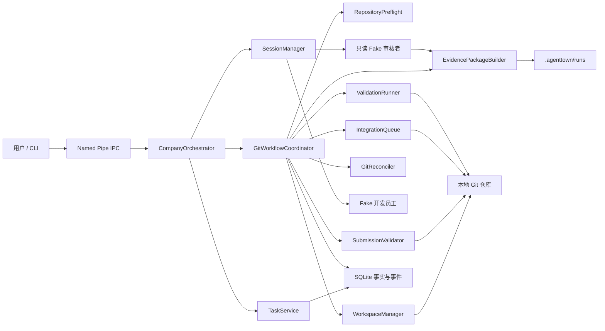
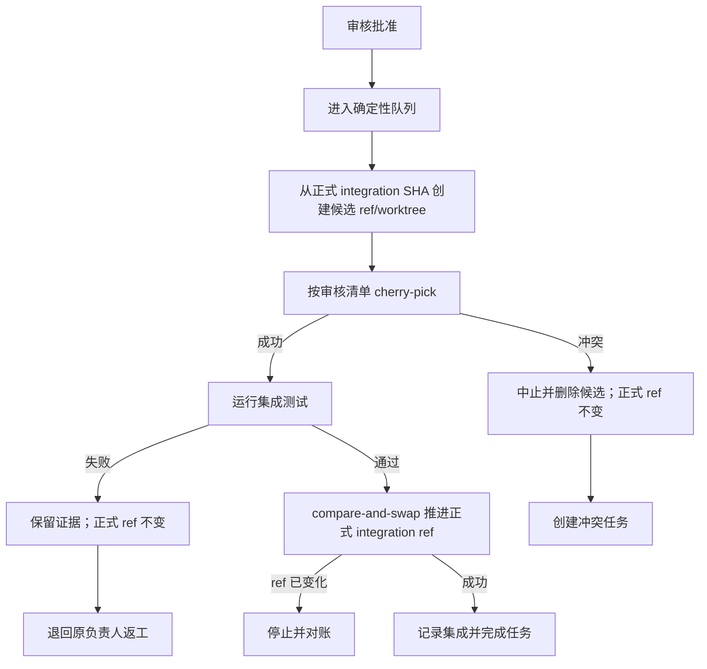

# AgentTown P1B Git 协作闭环设计

- 日期：2026-07-29
- 状态：已完成产品决策，待书面规格评审
- 上游：P1A Core + Fake Company
- 下游：P1C Claude Code、OpenCode、Hermes Agent 适配器
- 许可证：AGPL-3.0-only
- 首发平台：Windows；实现避免不必要的平台绑定

## 1. 决策摘要

P1B 为 AgentTown 增加真实 Git 多员工协作闭环，但继续使用确定性 Fake Agent。它解决的问题不是“如何调用真实 Agent”，而是“多个员工如何并行修改同一个项目，同时不覆盖用户工作区、保留可审核证据，并产生可交付的确定结果”。

P1B 的最小完整场景是：

1. 在一个干净的现有 Git 仓库中启动公司。
2. Core 记录启动时的分支名和 `HEAD`，创建运行集成分支。
3. 两个 Fake 开发员工分别在任务级分支和 worktree 中并行修改不同文件。
4. Core 验证提交归属、工作树清洁度和路径边界，重新运行预先批准的测试命令。
5. Core 生成不可变、可校验的审核包；只读 Fake 审核者批准或拒绝。
6. 已批准提交按确定顺序进入候选集成分支；通过集成测试后，Core 原子推进正式集成分支。
7. 关闭最后一个 CLI 后，公司保存状态并暂停；重新打开后，Core 对账数据库与 Git 状态并继续。
8. 最终结果停留在 AgentTown 集成分支。P1B 不合入用户分支、不 push、不创建 PR。

P1B 不包含真实 Agent 适配器、桌面 UI、非 Git 项目、子模块修改、自动安装工具和远程写操作。

## 2. 设计目标与成功标准

### 2.1 产品目标

- 证明两个可写员工可以真正并行工作，而不共享可写目录。
- 让每一项变更都可追溯到任务、员工、提交、测试和审核决定。
- 保证 Agent 的自然语言输出不能绕过 Git、测试、审核和集成规则。
- 在暂停、Core 崩溃和进程重启后，恢复可验证的 Git 事实。
- 让用户无需理解 Git worktree 的内部细节，也能检查和接收结果。

### 2.2 P1B 完成定义

P1B 只有同时满足以下条件才算完成：

- 两个 Fake 开发者能在独立任务 worktree 中并行产生真实提交。
- 用户原工作区和当前分支始终不被 Core checkout、提交、reset 或 merge。
- 提交只有通过归属验证、权威测试和只读审核后才有资格集成。
- 独立任务按照任务 DAG 拓扑顺序和稳定创建序号集成。
- 集成冲突不会污染正式集成分支，并转化为可分配的冲突任务。
- 集成测试失败不会推进正式集成分支。
- 暂停和重启后，数据库、refs、worktree、提交和审核包能够对账。
- CLI 能显示员工工作区、提交、审核、集成和最终交付状态。
- 普通 CI 使用临时本地 Git 仓库和 Fake Agent 完成全部验证，不访问 GitHub。

### 2.3 非目标

- 不接入 Claude Code、OpenCode 或 Hermes Agent；它们属于 P1C。
- 不做桌面办公室、网页看板或嵌入式终端。
- 不自动初始化非 Git 目录。
- 不自动 stash、commit、丢弃或恢复用户已有修改。
- 不合并到用户当前分支，不 push，不发布，不部署，不创建外部资源。
- 不支持员工修改 Git 子模块。
- 不承诺完整管理 Git LFS，只允许仓库已有 LFS 指针按普通文件流转。
- 不实现通用容器或操作系统级 Agent 沙箱。

## 3. 方案比较

### 3.1 方案 A：Core 拥有确定性 Git 状态机

Core 创建分支和 worktree，验证提交，运行权威测试，生成审核包，并在临时候选分支完成集成。Agent 只能通过结构化动作提交意图。

优点：

- 与 P1A“Agent 提议、Core 验证并执行”的原则一致。
- 可恢复、可测试、可审计。
- 真实 Agent 接入后无需信任其 Git 描述。
- 冲突、越界和测试失败都有确定行为。

代价：

- P1B 需要新增 Git 领域模型、持久化和恢复逻辑。
- 不能直接复用 Agent 自己随意形成的 Git 工作流。

### 3.2 方案 B：Agent 自行操作 Git，Core 事后审计

Core 只为 Agent 提供目录，Agent 自己创建分支、提交和合并。

优点是开发量较小，Agent 自由度高；缺点是 Core 无法可靠区分事实与声明，难以保证恢复、归属、审核边界和一致性。

### 3.3 方案 C：共享工作区加文件锁

所有员工在同一目录工作，Core 用文件锁降低覆盖概率。

优点是直观；缺点是锁不能解决跨文件语义冲突、构建产物污染、暂存区共享和 Agent 绕过锁的问题，也不符合真实多人开发方式。

### 3.4 选择

采用方案 A。P1B 的核心价值正是建立可信的协作底座，不能把关键 Git 事实交给不可确定的 Agent 输出。

## 4. 总体架构



### 4.1 组件职责

`RepositoryPreflight`

- 检测 Git 可用性和所需能力。
- 要求 Git 2.31.0 或更高版本，并对 worktree、porcelain v2、原子 `update-ref` 等实际能力做探测；版本满足但能力探测失败仍拒绝启动。
- 确认项目是 Git 仓库且项目根目录等于仓库工作树根目录。
- 创建 AgentTown 本地排除规则后检查用户工作区是否干净。
- 记录当前分支名、基线 SHA、仓库公共目录和对象格式。
- 拒绝 detached `HEAD`、未完成的 merge/rebase/cherry-pick/revert 和不安全仓库状态。

`WorkspaceManager`

- 创建和登记运行集成 worktree、任务分支与任务 worktree。
- 保证路径位于 `.agenttown/worktrees/<run-id>/`。
- 验证 worktree 不是符号链接或重解析点逃逸。
- 暂停时保留工作区；只在用户显式清理时移除。

`SubmissionValidator`

- 验证提交范围连续且位于任务基线之后。
- 验证所有提交可达于任务分支，而不是来自未声明 ref。
- 检查工作树和 index 清洁、提交范围非空、路径未越界。
- 拒绝子模块 gitlink 变化和未经支持的仓库结构变化。
- 生成规范化文件清单、文本 diff、二进制元数据和提交清单。

`ValidationRunner`

- 只执行公司配置中预先批准，或用户对精确参数批准过的结构化命令。
- 使用可执行文件加参数数组运行，不通过 shell 拼接字符串。
- 捕获 stdout、stderr、退出码、时间、超时与终止结果。
- 对日志做基础脱敏；不声称能够识别所有秘密。

`EvidencePackageBuilder`

- 把需求、验收标准、提交、diff、测试和开发者摘要组成版本化审核包。
- 对包内每个文件计算哈希，并生成总清单哈希。
- 审核包生成后不覆盖；返工产生下一修订版。

`IntegrationQueue`

- 只接收结构完整、测试通过且审核批准的 submission revision。
- 按任务 DAG 拓扑顺序，再按任务创建事件序号排序。
- 在临时候选分支和 worktree 中 cherry-pick 已审核提交。
- 候选通过集成测试后，以 compare-and-swap 方式推进正式集成 ref。

`GitReconciler`

- 启动和恢复时比较 SQLite 记录与真实 Git refs、提交和 worktree。
- 区分可安全恢复、中断操作可回滚、外部篡改和证据缺失。
- 不通过“猜测最合理状态”自动修复矛盾。

### 4.2 依赖方向

Git 组件不得直接解析 Agent 自然语言。`CompanyOrchestrator` 把已通过 `ActionPolicy` 的结构化动作交给 Git 协调器；Git 协调器产生事实和事件，再由任务状态机决定后续调度。

Git 命令执行封装在单一底层接口中。上层服务依赖类型化结果，不依赖命令输出文本的偶然格式；无法避免文本解析的命令必须使用固定 locale，并有针对真实 Git 输出的契约测试。

## 5. 仓库预检与基线

### 5.1 启动顺序

1. 解析并验证公司配置。
2. 确认 Git 可执行文件和所需子命令可用。
3. 确认项目是现有 Git 仓库，且没有进行中的 Git 操作。
4. 在 `.git/info/exclude` 中幂等加入 `/.agenttown/`；不修改项目 `.gitignore`。
5. 检查 tracked、staged 和普通 untracked 文件；任何一项非空都拒绝启动。
6. 被现有 ignore 规则忽略的文件不阻止启动。
7. 记录当前分支名和 `HEAD` 作为不可变运行基线。
8. 创建运行记录、正式集成分支及其独立 worktree。
9. 启动员工会话。

如果 `.git` 是 worktree 指针文件，Core 通过 Git 命令解析公共仓库目录，不自行假设 `.git` 必然是目录。

### 5.2 拒绝条件

- 目录不是 Git 仓库或不是仓库工作树根目录。
- 当前处于 detached `HEAD`。
- 没有首个提交。
- 用户工作区存在 staged、tracked 修改或普通 untracked 文件。
- 仓库正在 merge、rebase、cherry-pick、revert 或 bisect。
- `.agenttown`、Git 元数据或目标 worktree 路径存在越界符号链接/重解析点。
- 已存在同名 AgentTown ref，但其元数据不属于当前运行。

拒绝时只给出诊断和人工处理建议，不自动 `git init`、stash、reset、clean 或 checkout。

## 6. 运行、分支与工作区模型

### 6.1 命名

- 运行 ID：Core 生成的不可预测 UUID；CLI 同时显示短 ID。
- 正式集成分支：`agenttown/<run-id>/integration`
- 任务分支：`agenttown/<run-id>/<employee-id>/<task-id>`
- 候选分支：`agenttown/<run-id>/candidate/<attempt-id>`
- worktree 根：`.agenttown/worktrees/<run-id>/`
- 运行证据根：`.agenttown/runs/<run-id>/`

用户提供的员工和任务 ID 必须先通过既有标识符校验，再逐段构造 ref。Core 不接受 Agent 提供完整 ref 或任意路径。

### 6.2 任务工作区

员工身份和 Agent 会话可以跨任务存在，但每个可写任务有独立分支和 worktree。任务分支从分配时已确认的正式集成 SHA 创建；两个同时分配的独立任务可以具有相同基线。

任务执行上下文新增类型化字段：

```ts
interface WritableTaskContext {
  kind: "git_worktree";
  runId: string;
  taskId: string;
  employeeId: string;
  workspaceRoot: string;
  branch: string;
  baseCommit: string;
  approvedValidationCommandIds: string[];
}

interface ReviewTaskContext {
  kind: "review_package";
  runId: string;
  taskId: string;
  revision: number;
  manifestPath: string;
  manifestHash: string;
}
```

`AgentMessage` 携带其中一种上下文。领导和审核者没有可写项目 worktree；审核者只接收 `ReviewTaskContext`。

### 6.3 生命周期

- 分配：创建任务 ref 和 worktree，持久化后再把任务发送给员工。
- 执行：员工只在任务 worktree 中工作。
- 提交：worktree 必须清洁，Core 记录声明的提交范围。
- 返工：保留同一任务分支，在原范围之后追加提交，产生新 submission revision。
- 暂停：不删除 refs、worktree 或证据。
- 完成：默认仍保留全部运行资产。
- 清理：只有显式 CLI 命令可以移除；分支和证据需要更强确认。

## 7. 提交协议与权威测试

### 7.1 `task.submit` 结构

P1B 把松散的 `artifacts`、`evidence` 字符串升级为结构化提交载荷：

```ts
interface GitTaskSubmission {
  schemaVersion: 1;
  headCommit: string;
  commits: string[];
  changeSummary: string;
  validationCommandIds: string[];
  reportedResults: Array<{
    commandId: string;
    outcome: "passed" | "failed" | "not_run";
    summary: string;
  }>;
  knownRisks: string[];
}
```

Core 从 Git 自行推导真实提交范围和 diff，不相信员工声明的文件清单。`commits` 必须是从任务基线之后到 `headCommit` 的连续、无遗漏、有序提交集合。

### 7.2 验证命令配置

公司 YAML 增加用户拥有的结构化验证命令：

```yaml
validation:
  commands:
    - id: unit-tests
      executable: pnpm
      args: [test]
      cwd: .
      timeout_seconds: 600
  integration_command_ids: [unit-tests]
```

规则如下：

- `cwd` 必须解析到目标 worktree 内。
- `executable` 和 `args` 分开传递，默认 `shell: false`。
- P1B 单条命令默认超时 600 秒，配置范围为 1 秒至 3600 秒。
- 任务创建时只能引用已定义命令 ID。
- Agent 建议的新命令不自动执行；Core 创建包含精确 executable、args、cwd、超时和理由的用户审批。
- 用户批准只覆盖该精确命令和指定作用域，不形成无限通配授权。
- 超时、无法启动、非零退出码和进程树无法清理都视为失败。

员工报告是审核材料，不是权威结果。Core 在提交验证阶段重新执行任务要求的全部命令；集成阶段在候选 worktree 重新执行 `integration_command_ids`。

### 7.3 日志

每次命令执行记录：

- 命令 ID、可执行文件、参数、cwd；
- 开始和结束时间；
- 退出码、信号、超时与清理结果；
- stdout 和 stderr 原始顺序流；
- 脱敏后的持久化日志及其哈希。

脱敏覆盖已知凭据字段、当前进程中明确标记为秘密的环境变量值和常见 token 形态。文档必须提示用户：任何启发式脱敏都不能保证发现所有秘密。

## 8. 审核包与独立审核

### 8.1 文件布局

```text
.agenttown/runs/<run-id>/reviews/<task-id>/<revision>/
  manifest.json
  task.json
  commits.json
  change-summary.md
  changes.patch
  files.json
  validation/
    <command-id>.json
    <command-id>.log
```

`manifest.json` 记录 schema 版本、运行/任务/员工标识、基线、提交范围、每个文件的 SHA-256、生成时间和总清单哈希。

### 8.2 内容与限制

审核包包含：

- 原始任务目标、依赖和验收标准；
- 任务基线、提交列表和提交元数据；
- 完整文本 diff；
- 变更文件状态、大小和哈希；
- 二进制文件路径、大小和哈希，不内嵌二进制内容；
- 权威测试的命令、退出结果和脱敏原始输出；
- 开发者摘要和已知风险。

diff 超过 2 MiB 时产生警告；超过 20 MiB 时拒绝提交并要求拆分任务。公司配置允许把警告阈值设为 256 KiB 至 20 MiB，把硬限制设为 1 MiB 至 100 MiB，并要求警告阈值不大于硬限制。

审核包生成后不可覆盖。Core 以哈希而不是文件只读属性作为完整性依据；只读属性只作为辅助保护。审核返回前再次校验哈希，任何变化都转化为篡改错误并暂停审核。

### 8.3 审核决定

```ts
interface ReviewDecision {
  schemaVersion: 1;
  decision: "approve" | "reject";
  findings: Array<{
    severity: "blocking" | "advisory";
    evidence: string;
    requiredChange: string | null;
  }>;
  coverageGaps: string[];
  summary: string;
  reviewedManifestHash: string;
}
```

- 只有 `blocking` finding 可以形成拒绝。
- `advisory` finding 被保留，但不阻止集成。
- `approve` 不得包含 blocking finding。
- `reject` 必须至少包含一个有证据和必改项的 blocking finding。
- 审核者不能修改验收标准；需求争议由领导向用户升级。
- 连续两轮拒绝后，任务暂停并请求用户决定。

审核批准只表示该 submission revision 有资格进入集成队列，不立即把任务标记为 `completed`。

## 9. 确定性集成

### 9.1 队列顺序

只有依赖任务已完成的已批准 submission 才能进入队列。队列使用：

1. 任务 DAG 的稳定拓扑层级；
2. 同层任务的 `createdEventSequence`；
3. 任务 ID 作为最终稳定决胜字段。

同一层中创建更早但尚未具备集成资格的任务，会阻止其后的任务推进。这牺牲少量吞吐量，换取简单、可解释和可重放的顺序。

### 9.2 原子集成尝试



Core 不直接在正式集成 worktree 上执行可能失败的 cherry-pick。每次尝试：

1. 读取并记录正式集成 ref 的期望旧 SHA。
2. 从旧 SHA 创建唯一候选 ref 和 worktree。
3. 按审核包声明的提交顺序 cherry-pick。
4. 运行集成测试。
5. 所有条件通过后，用 compare-and-swap 更新正式集成 ref。
6. 更新正式集成 worktree到新 SHA。
7. 在同一事实提交中记录 integration attempt、任务完成和事件。

Git ref 更新与 SQLite 无法组成真正的跨系统事务，因此使用可重放的意图记录：

- 先持久化 `prepared` 集成意图及期望旧/新 SHA；
- 再 compare-and-swap 更新 ref；
- 最后持久化 `committed`；
- 恢复时依据 ref 是旧 SHA 还是新 SHA完成回滚或补记，其他值视为外部篡改。

### 9.3 集成冲突

cherry-pick 冲突时：

- 立即中止候选操作并验证候选 worktree恢复干净。
- 正式集成 ref 和 worktree保持不变。
- 原任务进入 `blocked`，记录冲突文件和 Git 原始证据。
- Core 创建一个带 `conflictForTaskId` 的结构化冲突任务，但不分配员工。
- 领导只能从预设的可写员工中选择负责人。

冲突任务从当前正式集成 SHA 创建新 worktree。Core把原已审核提交应用到候选工作区并停在冲突状态，开发者负责语义解决。解决提交必须重新运行测试和接受完整审核。

冲突任务集成成功后，其 submission 取代原任务失败的集成尝试；Core 同时完成冲突任务和被阻塞的原任务。不得形成依赖原任务完成才能运行的循环。

### 9.4 集成测试失败

测试失败时正式集成 ref 不变，失败日志进入新的集成证据。原任务返回原负责人返工并增加 submission revision，不消耗 Agent 会话失败重试次数；它受审核循环上限约束。Core 不自动修改测试或降低标准。

## 10. 状态模型与持久化

### 10.1 任务语义调整

P1A 中 `task.approve` 会立即把任务转为 `completed`。P1B 改为：

- `task.approve`：保存审核决定，把 submission 标记为 `approved`，任务保持 `review`，等待集成。
- 集成成功：任务从 `review` 转为 `completed`。
- 审核拒绝：任务从 `review` 返回 `running`。
- 集成冲突：任务从 `review` 转为 `blocked`。
- 集成测试失败：任务返回 `running`，生成返工上下文。

审批、审核、提交和集成状态使用独立记录，不把所有 Git 中间状态塞入 `TaskState`。

### 10.2 新增事实

P1B 新增以下持久化实体：

- `git_runs`：仓库、原分支、基线、正式集成 ref/SHA、运行状态。
- `git_workspaces`：任务、员工、路径、分支、基线、当前 head、状态。
- `git_submissions`：任务修订、声明与验证后的提交范围、摘要、状态。
- `validation_runs`：命令、作用域、时间、结果、日志路径和哈希。
- `review_packages`：路径、清单哈希、大小、状态。
- `review_decisions`：决定、findings、审核者和对应清单哈希。
- `integration_attempts`：顺序、旧/新 SHA、候选 ref、状态和失败证据。

所有记录包含 `company_id` 和 `run_id`，涉及任务的记录包含 `task_id`。路径存储为规范绝对路径，同时保存相对运行根路径用于可移植显示。

### 10.3 数据库升级

P1B 引入显式 schema 版本和事务性迁移：

- 现有 P1A 数据库识别为 schema v1。
- P1B 只做 v1 → v2 的增量建表和必要索引，不删除 P1A 数据。
- 迁移前验证数据库完整性；迁移失败保持原版本并拒绝启动。
- 不通过删除 `.agenttown` 或重建数据库解决迁移问题。

## 11. 暂停、恢复与外部篡改

### 11.1 检查点

公司检查点除 P1A 会话信息外，还记录：

- 运行 ID、正式集成 ref 和已知 SHA；
- 活跃任务 worktree、分支和已知 head；
- submission/review revision；
- 集成队列游标；
- 正在进行的 validation 或 integration attempt。

暂停会先停止新调度，再终止有界测试进程、完成或标记 Git 意图、刷新事件和数据库，最后暂停 Agent 会话。它不删除任何 Git 资产。

### 11.2 恢复分类

`GitReconciler` 逐项给出以下结果之一：

- `verified`：Git 与数据库完全一致，可继续。
- `completed_recovery`：ref 已推进但数据库仍为 prepared，可安全补记。
- `rolled_back_recovery`：ref 未推进，可清理候选并回到旧状态。
- `user_workspace_changed`：用户原工作区在运行期间变化；记录警告，但不影响独立 worktree。
- `tampered`：AgentTown ref、任务分支、worktree head 或审核包出现无法解释的变化。
- `missing`：必要 ref、commit、worktree 或证据被外部删除。

`tampered` 和 `missing` 会暂停相关任务或公司并请求用户决定。Core 不自动重建或覆盖外部变化。

## 12. 路径、安全与破坏性操作

- AgentTown 的文件写入仍限制在项目 `.agenttown/` 和该仓库的 AgentTown refs。
- 所有路径在访问前做绝对化、真实路径和边界检查。
- Windows 重解析点和符号链接按越界风险处理。
- Core 不读取或复制第三方 Agent 凭据。
- 普通日志不记录环境变量全集、远程 URL 中的凭据或命令环境秘密。
- Git 命令不接收由 Agent 拼接的完整命令行。
- 用户原工作树永远不是 destructive Git 命令的目标。
- reset、checkout、clean 和删除只允许作用于经过数据库登记并再次验证的 AgentTown 候选/任务 worktree。
- P1B 不修改远程 refs。

显式清理分级：

1. 默认清理只移除已完成运行的 AgentTown worktree；已完成或失败的临时候选 ref 由对应集成尝试在验证安全后自行回收，不属于用户清理命令的扩大范围。
2. 删除任务/集成分支需要列出精确 refs 并再次确认。
3. 删除审核包、日志和运行数据库证据需要独立确认。
4. 非交互模式必须提供精确运行 ID 和对应确认参数；不支持“清理所有”通配操作。

## 13. CLI 体验

P1B 保留现有命令并增加最小必要表面：

- `doctor`：增加仓库根、Git 状态、进行中操作、worktree 和 ref 能力检查。
- `status`：显示运行短 ID、基线、集成 SHA、队列和阻塞原因。
- `tasks`：增加 workspace、submission revision、审核和集成状态。
- `timeline`：显示 workspace、validation、review、integration 和 reconciliation 事件。
- `workspaces`：显示员工、任务、分支、路径、head 和清洁状态。
- `evidence <task-id> [--revision N]`：显示审核包路径、哈希和摘要。
- `deliver`：显示集成分支、最终 SHA、任务/审核/测试摘要和人工检查/合入命令。
- `cleanup <run-id>`：默认只清理 worktree；分支和证据使用独立显式参数与确认。

CLI 面向普通用户使用“员工工作区”“集成结果”等产品语言，同时在诊断区保留真实 Git ref、SHA 和路径。P1B 不增加交互式 Git 教程，也不替用户执行最终 merge。

最终 `deliver` 至少输出：

- 原分支与运行基线；
- AgentTown 集成分支和最终 SHA；
- 每个任务的负责人、提交、审核和测试结果；
- 未解决的 advisory findings 和已知风险；
- `git diff <base>..<integration>`、checkout/merge 的建议命令；
- “尚未 push、尚未合入用户分支”的明确提示。

## 14. 事件与可观测性

新增事件至少包括：

```text
git.run.created
git.workspace.created
git.workspace.verified
git.submission.received
git.submission.rejected
validation.started
validation.completed
review.package.created
review.decision.recorded
integration.queued
integration.prepared
integration.conflicted
integration.validation_failed
integration.committed
git.reconciliation.completed
git.tampering_detected
git.cleanup.completed
```

事件只陈述已验证事实。进度不能根据进程存活或自然语言猜测，例如只有审核包落盘并验证哈希后才能发出 `review.package.created`。

## 15. Fake Agent 扩展

P1B 不让 Fake Agent 自由执行任意 Git 命令。测试场景通过类型化、确定性的 Git fixture 指令驱动：

- 创建或修改指定的普通文本文件；
- 生成一个或多个确定提交；
- 留下脏工作树以验证拒绝；
- 声明错误提交范围；
- 生成审核批准、审核拒绝和返工；
- 制造两个可独立合入的并行变更；
- 制造确定的同文件冲突；
- 在暂停点等待，以验证恢复。

fixture 只在临时测试仓库和已验证任务 worktree 中运行。生产模式的 Fake Agent 仍不得获得任意项目外路径。

## 16. 测试策略

### 16.1 单元测试

- ref 和路径构造、标识符边界。
- dirty/untracked/ignored 仓库分类。
- 提交范围、可达性和工作树清洁验证。
- 子模块、符号链接、二进制文件和 diff 限制。
- 验证命令审批、超时和结果分类。
- 审核包清单、哈希、不可变修订和篡改检测。
- 审核决定结构与 blocking/advisory 语义。
- DAG 集成排序和队列阻塞。
- prepared/committed 集成意图恢复。
- v1 → v2 数据库迁移。

### 16.2 Git 集成测试

每项测试创建新的临时本地 Git 仓库：

- 两个任务 worktree 并行修改不同文件且互不覆盖。
- 用户原工作区从未 checkout 到 AgentTown ref。
- 脏仓库和进行中 Git 操作拒绝启动。
- 多提交范围完整验证。
- 测试失败和审核拒绝不会进入集成分支。
- 候选 cherry-pick 成功后原子推进正式 ref。
- 冲突中止后正式 ref、index 和 worktree保持干净。
- 冲突任务解决并重新审核后完成原任务。
- 外部修改 ref、删除 worktree和篡改审核包能够检测。
- 暂停/重启覆盖 prepared 更新前、ref 更新后和 SQLite commit 前的恢复点。

### 16.3 端到端验收

主 E2E 使用四人默认公司：

- Fake 领导；
- Fake 开发者 A；
- Fake 开发者 B；
- 只读 Fake 审核者。

完整流程：

1. 从干净 Git fixture 仓库启动。
2. 领导创建两个同层并行开发任务。
3. 两名开发者在独立任务 worktree 完成真实修改和提交。
4. 在提交前关闭最后一个 CLI，使公司暂停。
5. 重启后对账并继续两个任务。
6. Core 重新运行权威测试并生成两个审核包。
7. 审核者批准；Core 按稳定顺序集成并运行项目测试。
8. `deliver` 报告最终分支和 SHA，用户原分支保持在初始 SHA。

第二个 E2E 覆盖冲突：

1. 两个任务修改同一行并分别通过审核。
2. 第一个任务集成成功，第二个任务产生冲突。
3. 正式集成分支保持在第一个任务的 SHA。
4. Core 创建冲突任务，领导分配给预设开发者。
5. 开发者解决、测试、重新审核并集成。
6. 冲突任务和原任务均以可追溯证据完成。

普通 CI 设置禁止真实 Agent 探针，不需要模型凭据、GitHub 登录、网络或付费调用。

## 17. 实施边界与后续阶段

P1B 是一个独立可评审子项目，实施计划不得夹带 P1C：

1. Git 事实模型、迁移和预检。
2. 任务 worktree 和提交协议。
3. 权威测试与审核包。
4. 只读审核状态机。
5. 候选集成、冲突任务与恢复。
6. CLI、Fake Agent fixture 和完整 E2E。

P1B 完成并通过独立评审后进入 P1C，顺序预定为：

1. Claude Code 领导适配器；
2. OpenCode 开发者适配器；
3. Hermes WSL2 只读审核适配器。

P1C 复用 P1B 的类型化 `WritableTaskContext`、`ReviewTaskContext`、提交协议和审核包，不允许每个适配器发明自己的 Git 工作流。

## 18. 已确认的产品决策

本规格固化了 2026-07-29 用户确认的全部推荐项：

- 先 P1B、后 P1C，不并行开发真实适配器和 Git 底座。
- 现有 Git 仓库、干净工作区、启动 `HEAD` 基线。
- 每任务独立分支/worktree，正式集成也使用独立 worktree。
- AgentTown 数据使用本地 exclude，不修改项目 `.gitignore`。
- Core 验证提交和重新运行测试，不相信 Agent 摘要。
- 审核包版本化、哈希校验、审核者只读。
- cherry-pick 已审核提交，按稳定 DAG 顺序集成。
- 候选分支验证成功后才原子推进正式集成 ref。
- 冲突创建任务，不由 Core 猜测解决。
- 暂停保留资产，清理必须显式且分级确认。
- 最终结果停留在 AgentTown 集成分支，不自动 merge、push 或创建 PR。
- Windows 是首发门槛，普通 CI 全部使用本地 Fake Agent 和临时仓库。
