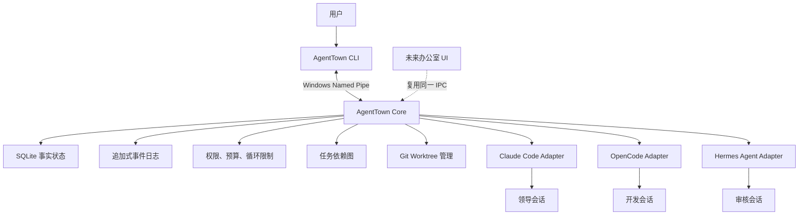

# AgentTown 产品概念书

> 本文档基于 2026-07-18 起我与 Codex 的完整对话（主线程 + 61 个子代理会话）整理而成，所有概念、决策与边界均来自对话中的真实讨论与确认，未做虚构加工。

---

## 一、一句话定位

> **AgentTown 是一个运行在个人电脑上的开源多 Agent 协作工具（"赛博公司"调度器）：用户预先配置公司的岗位、员工和权限，由一名领导 Agent 理解目标、拆分任务并调度固定员工，开发、审核等员工在独立会话与 Git worktree 中协作完成项目。**

这个定位是在 2026-07-18 的产品概念讨论中逐步收敛出来的。最初的设想是："把 agent 整合成一个公司，每个 agent 分工（同一个 agent 软件每一个进程就是一个 agent），开发一个调度器，作用把所有 agent 整合在一起来完成项目，看板可以看到每个 agent 的工作进度、目前在干什么、用的 token 情况、上下文情况。"

---

## 二、为什么做 AgentTown（动机与痛点）

对话（2026-07-18）中明确的核心动机：

1. **现状是一个人操作一个 agent**："目前的 agent 时代下，每一个 agent 都像一个员工，现状大多是一个人操作一个 agent。"一个 Agent 同时理解需求、写代码、测试和审核，难以真正并行，上下文也容易臃肿。
2. **无法并行**："同一个 agent 干太多活了，其实可以像真实公司一样各司其职。"
3. **异构协作**："用户可以让不同的 agent 一起干活，比如 Hermes agent、claude code、open code 等不同 agent 同时干同一个项目。"
4. **产品形态灵感**：观察到 "open claw"（Claude Code 的通俗称呼）是第一个把 Agent 带出圈的——尽管架构和性能不如 Codex、Claude Code、OpenCode，但它是第一个进入大众视野的。**"所以我对这个产品的定位相当于是 agent 界的 open claw……我自然是无法与大厂竞争实力的，所以我想侧重点在进入大众视野。"**

一句话概括（对话原意）：**"相当于在电脑中放了个赛博公司。"**

---

## 三、核心概念与关键决策（全部来自对话确认）

### 3.1 什么是"一个 Agent"

对话确认（问题 81 的回答）：**"一个 agent 就是一个在运行的一个 agent 会话。"** 同一个 Agent 软件的每一个进程就是一个 Agent。**"我们只负责把 agent 整合在一起，agent 什么都能干"**——AgentTown 不开发 Agent，只做整合工具。

### 3.2 "公司"是交互隐喻，不是重写 Agent 架构

对话明确：**"我们这一类'公司'跟 agent 开发不太一样，只是调用别人开发好的 agent。"** 我们不负责模型推理、Agent 工具调用循环、编码能力、上下文管理、Agent 自身规划——只做"一个很薄但关键的'公司运行层'"。

### 3.3 领导 Agent（CEO）+ 调度器（操作系统）

用户提出关键问题："能不能让这些 agent 的最高领导者，即选出一个 agent 来当老大，然后它负责调用其他 agent？"

结论（对话确认）：

> **领导 Agent 是 CEO，调度器是公司的操作系统和行政基础设施。**

- **领导 Agent 负责"管理决策"**：理解用户目标、拆分任务、决定调用谁、检查进度、安排审核、遇到问题时重新分配。
- **调度器负责"系统执行"**：启动进程、创建会话、传递消息、记录状态、控制权限、统计 Token、暂停和恢复任务。
- **领导 Agent 也由调度器创建**（用户明确："其实领导 agent 也应该是由调度器创建的"），不存在循环依赖。

### 3.4 固定员工名单（防幻觉）

用户明确要求：**"领导 Agent 应当只能调用用户预先配置好的'员工名单'，要是可以根据任务自行决定创建哪种 Agent、创建多少个的话，agent 比较容易出现幻觉。"**

因此：

- 调度器拥有进程和会话控制权；领导 Agent 拥有任务和人员调配权；用户拥有公司配置、项目方向和最终干预权。
- 领导发出的不是任意系统命令，而是受约束的请求；调度器验证名单、权限后执行。
- **"Agent 可以提出决定，但确定性调度器负责验证和执行。"**

### 3.5 一起启动 + 后台运行 + 可持续对话

- 所有预设员工在项目开始时一起启动（"开了也可以不让那个 agent 干活"）。
- Agent 默认在**后台虚拟终端**中运行，不弹出多个系统终端窗口——用户平时只看到"赛博办公室"，点击员工可展开内嵌终端。
- 进程存活期间，调度器可以切换回之前的对话继续布置任务（原会话从未关闭）；调度器重启后优先用 Agent 原生恢复能力，不支持恢复的 Agent 通过"交接包"重建会话。

### 3.6 默认只和领导沟通，可随时接管

用户拍板：**"默认只和领导沟通，但允许用户随时直接接管员工会话作为兜底。"**

- 用户接管员工后，该员工自动任务暂停，直到释放接管锁；输入的指令自动同步给领导；结束接管后由员工自动向领导提交"人工干预摘要"。

### 3.7 架构选型：方案 B（混合控制平面）

对话中对比了三条架构路线，最终确认**方案 B**：

| 决策 | 负责人 |
| --- | --- |
| 怎样理解用户目标 | 领导 Agent |
| 怎样拆任务、分给谁 | 领导 Agent |
| 员工是否真实存在 | 调度器 |
| 是否允许发起任务 | 调度器 |
| 启动、恢复、停止会话 | 调度器 |
| 任务真实状态和依赖 | 调度器 |
| 审核不通过后怎么办 | 领导按规则决策 |
| 权限、预算、循环上限 | 调度器强制执行 |
| 用户直接接管 | 调度器执行并通知领导 |

核心原则：**"Agent 可以申请和决策，但不能直接修改公司的客观状态。"** 例如领导说"让不存在的第五名员工工作"，调度器直接拒绝；领导说"任务已经完成"但任务没有审核记录，调度器仍保持"待审核"。

### 3.8 产品设计第一部分的定位（2026-07-20 确认）

> 调度器是一个运行在个人电脑上的开源多 Agent 协作工具，它把 Codex、Claude Code 等独立 Agent 会话组织成一间可视化的赛博公司，由领导 Agent 管理固定员工团队，共同完成软件项目。

---

## 四、目标用户与市场定位（来自 07/18 问答）

对话中用户对 41 个关键问题的回答：

- **首要用户**："AI 编程重度用户，最好是懂点技术但不多的人。"
- 用户自己就是首要目标用户（"是"）。
- 目标用户现用工具：claude code、codex、open code、Hermes agent；"我会同时打开三个最多"。
- 现在怎样协调："通过 skill 和 system prompt。"
- **大众产品**："不针对于强调技术的团队……可以针对一些常规的公司。"
- 市场观察：喜欢这个概念的用户，"跟当时的 open claw 用户有异曲同工之妙——当时很多人讨论 open claw 并不是因为真的用 open claw 做出来了什么……而是他们看到了未来，并且觉得好玩。"
- **国内用户优先**，中英文都要（"是"）。
- 第二目标用户：产品经理。
- 使用时长："几小时"；"离开后系统继续工作"。
- 最低门槛：能 vibe coding 出一个小项目。

**传播的关键画面**（问题 301 的回答）："让大众看到了未来，而且只需要一台电脑。"

---

## 五、核心体验：赛博办公室

对话确认的首版产品体验（07/18-07/26）：

- **办公室场景是产品默认首页**：每个 agent 坐在一个工位上，头上的气泡显示信息。
- 员工状态可视化：员工坐在工位（空闲）、敲键盘（执行中）、头顶气泡（当前任务）、感叹号（等待批准或阻塞）。
- 点击员工展开：职位、Agent 类型、当前任务、状态、会话摘要、Token、终端入口。
- 同时提供传统任务看板（第二视图）查看任务依赖和历史。
- 系统托盘显示公司仍在后台工作。
- 前端皮肤方案："对这个场景的前端皮肤方案不做太多，只做一个。"
- 首版办公室采用简单 2D 平面/像素风，不做复杂人物动画。

> 用户特别要求：**"默认公司可以按照你这个模板来，但是我希望最终形态是用户可以自由规定公司分工和公司结构。"** 底层从首版开始就采用通用组织结构（员工、职位、上下级、Agent 类型、权限、审核关系均可配置），三人/四人公司只是默认模板。

---

## 六、公司运行机制（借鉴大厂，对话 07/26 确认）

用户要求 web search 互联网大厂（尤其中国大厂）的公司运行逻辑，看有没有可以效仿的。结论：**不模仿大厂复杂的组织层级，只吸收经过验证的"运行机制"。**

| 来源 | 运行理念 | AgentTown 对应机制 |
| --- | --- | --- |
| 华为 | 权责清晰、分权制衡；项目中心制，明确授权、资源与预算 | 每项任务有唯一负责人；领导、执行、审核相互制衡；任务绑定资源和预算 |
| 字节跳动 | 坦诚清晰、以事实推动结论 | Agent 消息简洁、结构化，附日志、测试或 Diff 等证据 |
| 海尔 | 平台化、团队小微化 | 一家公司就是围绕用户目标成立的"小微团队"；Core 是共享服务平台 |
| 腾讯 | 用户价值优先；业务独立、平台提供公共能力 | 任务必须关联用户目标；日志、权限、存储、适配器由 Core 统一提供 |
| 阿里巴巴 | 客户第一、主动担当 | 模板可定义价值观，但必须转换成审核规则，不能只写口号 |
| Amazon / Netflix | 一个重大事项只有一个明确负责人；管理者提供上下文而非事事控制 | 每个任务只有一个 Owner；领导提供目标和上下文，员工自行选择实现方法 |

**由此形成的"公司宪法"（首版落实七条制度）：**

1. 每个任务只有一个直接负责人。
2. 每个任务必须说明它为用户创造什么价值。
3. 领导提供目标、背景和验收标准，不干涉员工的具体实现。
4. 员工交付必须附带可验证证据。
5. 审核者独立于执行者。
6. 失败后先返工，超过限制才逐级升级。
7. 项目结束后生成复盘，沉淀为公司公共记忆。

**明确不借鉴**：复杂汇报层级和委员会、员工排名与绩效竞争、"狼性"机制、让 Agent 靠信任自由越权、把价值观写成 Prompt 却没有确定性约束、为了像公司而增加大量虚拟职位。

---

## 七、首版边界（对话 07/20 确认）

### 首版明确做

- Windows 本地桌面端 + CLI（先 CLI，桌面 UI 后置，07/26 调整为"先做能干活的核心"）。
- 软件开发小队模板（默认模板：领导、开发者、测试者、审核者，共 4 名员工）。
- 固定员工名单与一个领导；任务分配、审核、返工和人工接管。
- 后台虚拟终端和会话恢复。
- 办公室视图、任务视图和运行时间线。
- 本地公共记忆、日志与项目配置。
- 简单预算、权限和循环限制。

### 首版明确不做

- 自研模型或 Agent 推理循环。
- 云同步、多人账号和远程公司。
- Agent 自动招聘或动态扩编。
- 模板市场和商业 Token 网关。
- 通用企业工作流引擎。
- 复杂办公室装修或人物动画。
- 多层级管理和多个部门。
- 宣称完整支持所有 Agent。

### 07/26 关键路线调整（用户选择 A）

桌面框架从关键路径移除（此前 Electron/Tauri 选型卡住了进度），**先做 CLI/后台内核，能让领导 Agent 调度 2–3 个员工完成项目**。

### 关闭行为（用户修正）

用户明确：**"我建议还是退出终端或者退出 ui 软件会把公司关掉。"**（避免 Agent 在用户不知情时继续消耗 Token。）关闭流程：停止接受新任务 → 中断并回收全部 Agent 进程 → 保存会话 ID、任务状态、日志和 Worktree → 公司状态变为 `paused` → 下次启动后由用户选择继续或终止。

---

## 八、技术架构（对话 07/26-07/29 确认）

- **技术栈**：Node.js + TypeScript（pnpm monorepo）；状态存储 SQLite + 追加事件日志；CLI 与后台 Core 通过 Windows Named Pipe 通信；公司与员工配置用 YAML + JSON Schema 校验；Agent 统一通过 PTY 启动和管理。
- **首版真实 Agent**（用户指定）：Claude Code、OpenCode、Hermes Agent；Codex 后续接入。三种 Agent 各自实现统一 `AgentAdapter`（能力驱动），Core 负责派工、状态、权限、预算和消息路由。
- **默认三人模板**：Claude Code 领导 / OpenCode 开发 / Hermes Agent 审核。**Alpha 演示用四人团队**：Claude 领导 + 2 个 OpenCode 开发 + Hermes 审核。
- **任务状态机**：`draft → ready → running → review → completed`，另有 `blocked / failed` 分支。
- **关键规则**：Agent 之间禁止直接通信（消息必须经过 Core）；Agent 输出不直接执行，必须转换为结构化指令并通过策略校验；同一 Reviewer 禁止审核自己完成的任务；最多返工两轮后询问用户；Core 执行确定性合并，冲突时创建修复任务，不自行猜测。
- **能力声明**：每个适配器启动时声明 `launch / streamOutput / sessionResume / interrupt / tokenUsage / contextUsage / nonInteractive` 能力，能获取就展示，不能就显示"未知"，绝不伪造。
- **恢复策略**：优先使用原 Session ID；不支持原生续聊的 Agent 通过重建会话恢复（`resume_mode: rebuilt`），不冒充原会话。

---

## 九、开源与命名（对话 07/20 确认）

- 用户对许可证的要求："我介意别人用我的项目来闭源商用。"
- 结论：**AGPL-3.0**（强 Copyleft：别人分发修改版时要按相同许可证提供源码；如果将修改版作为网络服务提供，也需要向网络用户提供对应源码），项目名称和 Logo 另设商标政策。
- 命名：用户拍板 **"叫 AgentTown 吧"**，GitHub 仓库描述由 Codex 拟定。
- 仓库：`S1nc-777/AgentTown`（公开）。
- 成功标准（07/18 问答）："互联网讨论度"；"如果获得很多 star 之类的"——但 07/26 首版最重要成功指标改为：**"真实完成一个项目，而不是 UI 完整度或 Star 数量。"**
- 盈利："可能会通过卖 token 类似于 open code go 这样的来赚钱，但是目前不考虑盈利。"
- 开源心态："上 github 之后只要有人愿意就可以吸收""愿意"接受贡献者。

---

## 十、演进路线（P0 → P1A → P1B → P1C → P1D）

对话中确定的路线图：

| 阶段 | 内容 | 状态 |
| --- | --- | --- |
| P0 可行性 | 探针协议、Fake Agent、PTY、Codex/Claude 适配器实验、Electron/Tauri 对比、评分器与 ADR | 已完成（部分实验被记录为失败/阻塞） |
| P1A Headless MVP | 无界面本地调度内核：Fake Agent 四员工公司、SQLite 事实库、Named Pipe、任务 DAG、暂停恢复、CLI | 已完成 |
| P1B Git 协作 | Git worktree 隔离、证据包、只读审核、确定性集成分支、冲突任务化、重启对账、CLI 接线 | 12 项中完成 11 项（Task 12 E2E 未开始） |
| P1C 真实 Agent | 接入 Claude Code、OpenCode、Hermes Agent 适配器 | 未开始 |
| P1D Alpha 验收 | 真实异构 Agent 协作完成一个项目 + 演示录像 | 未开始 |
| 桌面 UI | "赛博办公室"（工位、气泡、接管、看板） | 未开始 |

---

## 十一、产品哲学（对话凝练）

1. **"我们只是把 agent 有效地集合起来明确分工。"** —— 不做 Agent，只做公司。
2. **"让大众看到了未来，而且只需要一台电脑。"** —— 低门槛、可传播。
3. **"Agent 可以提出决定，但确定性调度器负责验证和执行。"** —— 防幻觉的第一道防线。
4. **"外观好玩、内核保持专业。"** —— 办公室是壳，状态机是核。
5. **"实用优先然后做取舍。"** —— 不追求公司模拟完整度，只保留对协作真正有用的机制。
